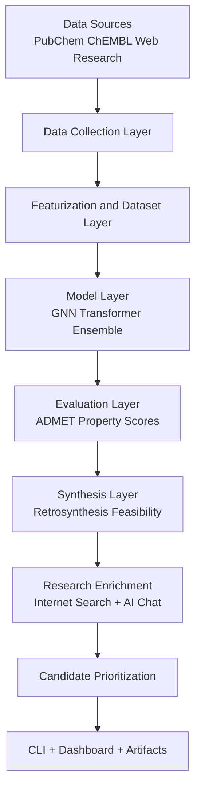
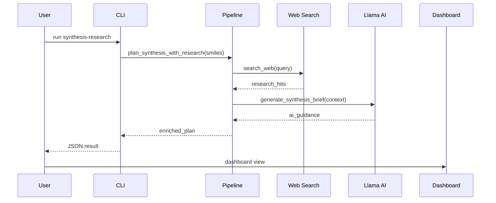
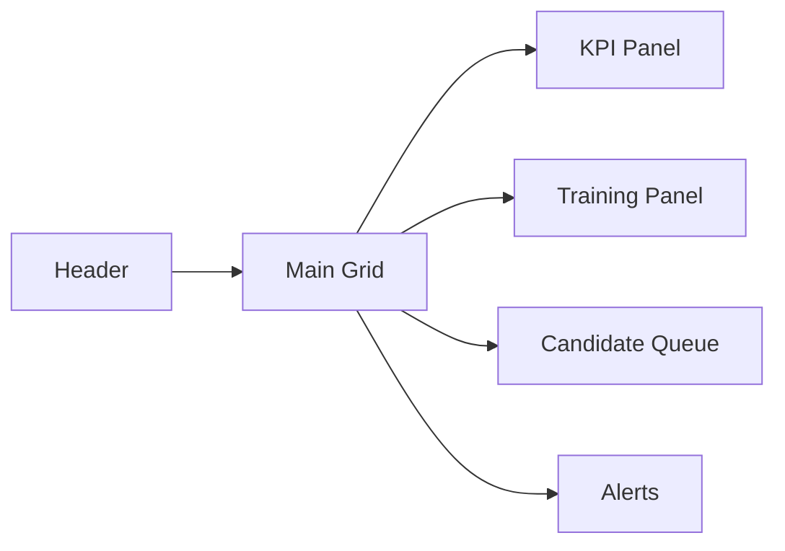
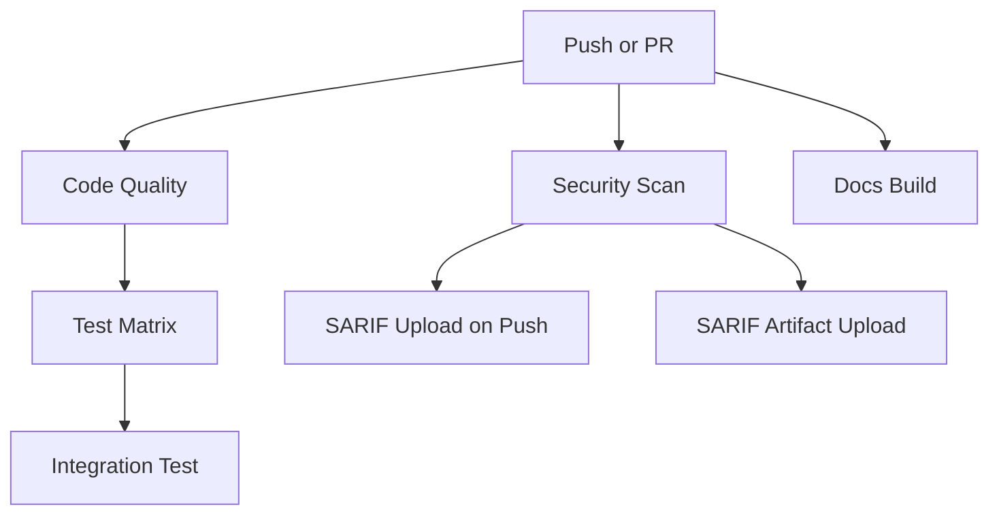
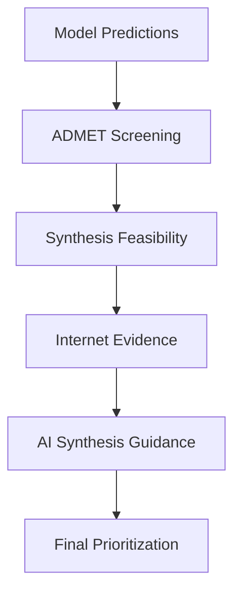

# ZANE Technical Documentation

Comprehensive engineering and scientific documentation for the ZANE autonomous AI drug discovery platform.

## Document Metadata

- Project: ZANE
- Repository: cosmic-hydra/zane
- Branch baseline: main
- Primary audience: ML engineers, MLOps engineers, computational chemists, research scientists
- Secondary audience: platform developers, pipeline maintainers, QA/DevSecOps contributors

## Table of Contents

1. Executive Overview
2. Product Objectives and Scope
3. Architecture Overview
4. Layer-by-Layer Deep Dive
5. Repository Trees and Module Maps
6. End-to-End Data and Decision Flow
7. Data Ingestion and Web Intelligence
8. Modeling and Prediction Stack
9. Retrosynthesis and Synthesis Feasibility
10. Internet Research and AI Chat for Synthesis
11. Optimization Strategies
12. Dashboard Operations and Monitoring
13. CLI Operations Manual
14. API and Object Reference
15. CI/CD and Security Pipeline Design
16. Testing and Quality Assurance
17. Experiment Management and Reproducibility
18. Performance Engineering
19. Reliability and Failure Recovery
20. Security and Responsible Use
21. Deployment and Environment Strategy
22. Extension Patterns and Plugin Concepts
23. Troubleshooting Playbook
24. Contribution and Review Standards
25. Appendix (Diagrams, Trees, and Examples)
26. License

## 1. Executive Overview

ZANE is a modular system that combines:

- molecular data collection
- cheminformatics featurization
- ML model training and inference
- ADMET and quality scoring
- retrosynthesis-informed triage
- internet-assisted research enrichment
- LLM-based synthesis chat support
- terminal-native operational dashboards

The platform is designed to reduce the gap between raw molecular datasets and actionable candidate prioritization.

## 2. Product Objectives and Scope

### 2.1 Objectives

- Make drug discovery workflows reproducible and scriptable.
- Provide practical defaults for teams without sacrificing extensibility.
- Enable internet-backed synthesis research for rapid context gathering.
- Support AI-assisted synthesis strategy drafting with clear guardrails.
- Maintain CI/CD quality and security checks without frequent false failures.

### 2.2 In Scope

- Scientific data pipeline automation
- Model training and candidate ranking
- Retrosynthesis planning support
- Security scan integration in CI/CD

### 2.3 Out of Scope

- Clinical decision automation
- Regulatory submission tooling
- Guaranteed synthetic route correctness without expert review

## 3. Architecture Overview

### 3.1 High-Level Architecture Diagram



### 3.2 Runtime Interaction Diagram



## 4. Layer-by-Layer Deep Dive

### 4.1 Interface Layer

Responsibilities:

- expose consistent CLI commands
- provide operational dashboard views
- format outputs for both humans and automation

Key files:

- `drug_discovery/cli.py`
- `drug_discovery/dashboard.py`

### 4.2 Orchestration Layer

Responsibilities:

- coordinate model training and prediction phases
- orchestrate synthesis planning and scoring
- compose enriched outputs from multiple subsystems

Key files:

- `drug_discovery/pipeline.py`
- `drug_discovery/agents/orchestrator.py`

### 4.3 Intelligence Layer

Responsibilities:

- train and evaluate predictive models
- produce property and ADMET outputs
- support score aggregation and optimization

Key files:

- `drug_discovery/models/*`
- `drug_discovery/evaluation/*`
- `drug_discovery/optimization/*`

### 4.4 Scientific Layer

Responsibilities:

- docking and molecular dynamics utilities
- retrosynthesis planning and synthetic accessibility
- feasibility-oriented ranking support

Key files:

- `drug_discovery/physics/*`
- `drug_discovery/synthesis/*`

### 4.5 Data Layer

Responsibilities:

- source collection and normalization
- quality filtering and deduplication
- feature generation for model compatibility

Key files:

- `drug_discovery/data/*`
- `drug_discovery/web_scraping/*`

## 5. Repository Trees and Module Maps

### 5.1 Top-Level Repository Tree

```text
zane/
├── .github/
│   └── workflows/
│       └── ci.yml
├── configs/
│   └── config.py
├── drug_discovery/
│   ├── agents/
│   ├── data/
│   ├── evaluation/
│   ├── knowledge_graph/
│   ├── models/
│   ├── optimization/
│   ├── physics/
│   ├── synthesis/
│   ├── training/
│   ├── web_scraping/
│   ├── ai_support.py
│   ├── cli.py
│   ├── dashboard.py
│   └── pipeline.py
├── tests/
├── README.md
├── DOCUMENTATION.md
├── requirements.txt
└── requirements-all.txt
```

### 5.2 Synthesis and Research Subtree

```text
drug_discovery/
├── synthesis/
│   ├── __init__.py
│   └── retrosynthesis.py
└── web_scraping/
    ├── __init__.py
    └── scraper.py
```

## 6. End-to-End Data and Decision Flow

1. Collect molecular records and references.
2. Featurize into graph/fingerprint representations.
3. Train selected architecture.
4. Evaluate model outputs with ADMET checks.
5. Plan synthesis and estimate feasibility.
6. Enrich synthesis with internet search evidence.
7. Draft AI synthesis guidance using Llama.
8. Combine evidence into prioritized candidate decisions.
9. Persist artifacts and monitor via dashboard.

## 7. Data Ingestion and Web Intelligence

### 7.1 Biomedical Scraping

The scraper module supports publication and trial data collection with quality filtering and deduplication helpers.

### 7.2 Internet Search Support

`InternetSearchClient` supports:

- Google Programmable Search when keys are configured
- Go fast-search backend for compiled high-performance retrieval
- DuckDuckGo HTML fallback when Google is unavailable

Environment variables:

- `GOOGLE_CSE_API_KEY`
- `GOOGLE_CSE_ID`
- `ZANE_GO_SEARCH_BIN`

### 7.3 Resource Reading Layer (URL + PDF)

After search hits are retrieved, ZANE can read actual linked resources:

- HTML URL reader for web pages and articles
- PDF URL reader for downloadable papers and reports

Implementation notes:

- class: `OnlineResourceReader`
- HTML extraction: `beautifulsoup4` with regex fallback
- PDF extraction: `pypdf` with page limits and character limits
- enrichment output fields on hits:
    - `resource_type`
    - `resource_read_success`
    - `resource_preview`
    - `resource_error` (if extraction fails)

### 7.4 Multi-Language Search Backend (Go)

ZANE is no longer Python-only in its runtime strategy.

The Go component at `tools/go/fastsearch/main.go` provides:

- compiled execution for lower overhead in repeated lookups
- deterministic JSON output for Python interoperability
- URL normalization for DuckDuckGo redirect links

Build command:

```bash
make build-go-fastsearch
```

Activation:

```bash
export ZANE_GO_SEARCH_BIN="$PWD/tools/bin/zane-fastsearch"
```

Direct usage example:

```bash
tools/bin/zane-fastsearch --query "EGFR inhibitor synthesis route" --max-results 5
```

### 7.3 Search Output Structure

Search results are normalized into dictionaries containing:

- `title`
- `url`
- `snippet`
- `source`

## 8. Modeling and Prediction Stack

Supported model families:

- molecular GNN
- molecular transformer
- ensemble combinations

Core prediction outputs include:

- target properties
- ADMET-related indicators
- confidence and feasibility-aligned ranking signals

## 9. Retrosynthesis and Synthesis Feasibility

### 9.1 Retrosynthesis Planner

`RetrosynthesisPlanner` provides:

- baseline route planning output
- synthetic accessibility heuristics
- optional enriched planning via research and AI chat

### 9.2 Feasibility Scoring

`SynthesisFeasibilityScorer` combines:

- synthetic accessibility transforms
- complexity-aware penalties
- optional retrosynthesis plan signals

## 10. Internet Research and AI Chat for Synthesis

### 10.1 Enriched Planning Method

`plan_synthesis_with_research(...)` supports:

- internet-backed evidence collection
- AI synthesis brief generation
- graceful fallback when network/model access is unavailable

### 10.2 AI Chat Behavior

`AISynthesisChat` uses Llama support with contextual prompts containing:

- molecule SMILES
- optional target protein
- top web research references

### 10.3 CLI Usage

```bash
python -m drug_discovery.cli synthesis-research "CCO" --target EGFR --max-results 5
```

Resource reading controls:

```bash
python -m drug_discovery.cli synthesis-research "CCO" --max-resource-reads 3
python -m drug_discovery.cli synthesis-research "CCO" --no-resource-read
```

This command will attempt backend resolution in this order:

1. Google CSE (if credentials are available)
2. Go fast-search backend (if `ZANE_GO_SEARCH_BIN` is configured)
3. Python DuckDuckGo fallback

Disable specific enrichments:

```bash
python -m drug_discovery.cli synthesis-research "CCO" --no-internet
python -m drug_discovery.cli synthesis-research "CCO" --no-ai
```

## 11. Optimization Strategies

Optimization modules support candidate ranking under trade-offs such as:

- potency vs synthetic ease
- predicted efficacy vs toxicity flags
- novelty vs route availability

## 12. Dashboard Operations and Monitoring

Dashboard views emphasize operational context:

- run identifiers and model mode
- KPI panel
- training monitor
- candidate queue
- AI copilot recommendations panel
- system alerts

### 12.1 AI-Enabled Dashboard Commands

```bash
python -m drug_discovery.cli dashboard --static --with-ai
python -m drug_discovery.cli dashboard --with-ai --ai-model-id artifacts/llama/tinyllama-1.1b-chat --ai-refresh-every 3
```

Behavior notes:

- if local AI model loading fails, the dashboard falls back to heuristic recommendations
- AI refresh cadence is controlled by `--ai-refresh-every`

### 12.2 Dashboard Layout Diagram



## 13. CLI Operations Manual

Primary commands:

- `train`
- `predict`
- `admet`
- `collect`
- `dashboard`
- `assist`
- `synthesis-research`

### 13.1 Examples

```bash
python -m drug_discovery.cli train --model transformer --epochs 10 --batch-size 32
python -m drug_discovery.cli predict "CC(=O)OC1=CC=CC=C1C(=O)O" --model gnn --checkpoint ./checkpoints/gnn_model.pt
python -m drug_discovery.cli admet "CC(=O)OC1=CC=CC=C1C(=O)O"
python -m drug_discovery.cli dashboard --static
python -m drug_discovery.cli assist "Summarize top candidate risks"
```

## 14. API and Object Reference

### 14.1 Key Objects

- `DrugDiscoveryPipeline`
- `RetrosynthesisPlanner`
- `SynthesisFeasibilityScorer`
- `InternetSearchClient`
- `AISynthesisChat`
- `LlamaSupportAssistant`

### 14.2 Return Data Patterns

Most workflow APIs return JSON-serializable dictionaries for easy persistence and CLI rendering.

## 15. CI/CD and Security Pipeline Design

### 15.1 Pipeline Stages

- code-quality
- test matrix
- integration-test
- security-scan
- docs build placeholder

### 15.2 Security-Specific Hardening

Security scan now includes:

- non-blocking Trivy step
- guaranteed SARIF creation fallback
- SARIF upload to GitHub Security on push events
- SARIF artifact upload for debugging

### 15.3 CI Flow Diagram



## 16. Testing and Quality Assurance

### 16.1 Test Coverage Areas

- data collection and dataset behavior
- model and pipeline flows
- evaluation and ADMET
- AI support guardrails
- synthesis research enrichment pathways
- internet search client behavior

### 16.2 Recommended Local Checks

```bash
python -m pytest -q
python -m ruff check .
python -m black --check .
```

## 17. Experiment Management and Reproducibility

Recommended run artifact policy:

- include timestamped run identifiers
- store effective config values
- preserve model checkpoints and output tables
- capture summary JSON for each major run

## 18. Performance Engineering

- use CPU for smoke tests and rapid checks
- move training to GPU for larger runs
- optimize batch sizes incrementally
- separate expensive web collection from model iterations

## 19. Reliability and Failure Recovery

Design principles:

- fail gracefully on external API disruptions
- preserve partial outputs where possible
- emit actionable errors for CLI users
- keep security scanning non-blocking but observable

## 20. Security and Responsible Use

Required guidance:

- treat outputs as research support only
- do not infer clinical guidance directly
- validate synthesis recommendations with experts
- maintain provenance of external internet sources

## 21. Deployment and Environment Strategy

- use virtual environments for reproducibility
- pin critical dependencies via requirements files
- use separate environments for CI and heavy local experiments
- store credentials in environment variables, not source code

### 21.1 Workspace Categorization Setup

Create the standard folders for data, checkpoints, logs, and outputs:

```bash
make setup-workspace
```

Create virtual environment and install project dependencies:

```bash
make setup-venv
```

Environment template file:

- `.env.example`

## 22. Extension Patterns and Plugin Concepts

### 22.1 Add a New Data Source

1. implement collection method
2. normalize schema
3. integrate into pipeline source selector
4. add tests for parser and merge flow

### 22.2 Add a New Model

1. create model class
2. add pipeline selection branch
3. validate trainer compatibility
4. add unit and integration tests

### 22.3 Add a New CLI Command

1. register parser command
2. implement handler function
3. add docs and test coverage

## 23. Troubleshooting Playbook

### 23.1 Internet Search Returns Empty

Possible causes:

- network restrictions
- blocked endpoint
- malformed query

Actions:

- retry with a simpler query
- disable internet step and use AI only
- verify network and DNS access

### 23.2 AI Guidance Unavailable

Possible causes:

- missing Hugging Face token
- model access restrictions
- transient hub/network issue

Actions:

- verify model access and token
- run with `--no-ai` to continue baseline flow

### 23.3 Security Upload Issues in CI

Actions:

- verify push-based security upload context
- inspect uploaded SARIF artifact
- review Trivy output logs for parser issues

## 24. Contribution and Review Standards

- keep PRs focused and scoped
- include validation outputs in PR description
- update docs for behavior changes
- avoid unrelated refactors in functional fixes

## 25. Appendix (Diagrams, Trees, and Examples)

### 25.1 Candidate Scoring Decision Diagram



### 25.2 Example Enriched Synthesis Output

```json
{
  "target": "CCO",
  "success": true,
  "num_steps": 3,
  "estimated_yield": 0.72,
  "research_query": "CCO EGFR synthesis route medicinal chemistry",
  "research_hits": [
    {
      "title": "Medicinal chemistry synthesis route reference",
      "url": "https://example.org/ref1",
      "snippet": "...",
      "source": "google-cse"
    }
  ],
  "ai_model_id": "meta-llama/Llama-3.2-1B-Instruct",
  "ai_synthesis_guidance": "Suggested route and risk points..."
}
```

### 25.3 Directory Tree Snapshot (Detailed)

```text
drug_discovery/
├── __init__.py
├── ai_support.py
├── cli.py
├── dashboard.py
├── pipeline.py
├── agents/
│   ├── __init__.py
│   └── orchestrator.py
├── data/
│   └── __init__.py
├── evaluation/
│   ├── __init__.py
│   └── predictor.py
├── knowledge_graph/
│   ├── __init__.py
│   └── graph.py
├── models/
│   ├── __init__.py
│   ├── e3_equivariant.py
│   ├── ensemble.py
│   ├── gnn.py
│   └── transformer.py
├── optimization/
│   ├── __init__.py
│   ├── bayesian.py
│   └── multi_objective.py
├── physics/
│   ├── __init__.py
│   ├── docking.py
│   └── md_simulator.py
├── synthesis/
│   ├── __init__.py
│   └── retrosynthesis.py
├── training/
│   ├── __init__.py
│   ├── closed_loop.py
│   ├── distributed.py
│   └── trainer.py
├── utils/
│   └── __init__.py
└── web_scraping/
    ├── __init__.py
    └── scraper.py
```

## 26. License

CC0 1.0 Universal

