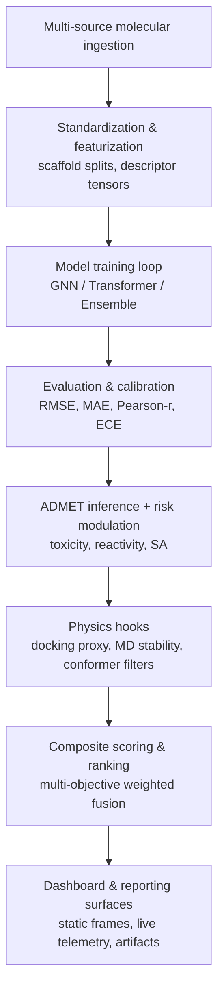

# ZANE: AI-native Drug Discovery Module - experimental version beta

<p align="center">
  
</p>

<p align="center">
  
</p>

A production-minded, research-first platform for molecular intelligence workflows, from data acquisition and model training to simulation-aware candidate prioritization and AI-assisted decision support.

> **License Notice:** This repository is not open-source. Viewing is limited to educational purposes; any other use requires prior written permission from Advaith Vaithianathan (advaithv.av7@gmail.com).

**ZANE Features:** ZANE ships with a professional terminal interface built around the KB721H66-branded dashboard and a seven-line ASCII header, presenting a simple-by-default layout that still lets operators click through to detailed analysis panels when needed. It supports simulation-only compound design so users can generate virtual carbon and hydrocarbon candidates from user-defined characteristics while monitoring training in real time, tracking every epoch to 100% completion with live loss metrics and model health. Beta-mode composition tables surface probable active, stabilizer, and carrier percentages to keep formulation in view, and the command-driven experience—complete with guided setup plus aliases such as `start` and `go`—keeps the workflow navigable without sacrificing depth.

## Executive Summary

ZANE unifies the core layers of computational drug discovery by connecting molecular data ingestion and harmonization with learning pipelines (GNN, Transformer, and ensemble modes) that track 100-epoch completion. Property and ADMET assessment sit beside simulation-only composition analysis and custom virtual compound generation for hydrocarbon or carbon scaffolds derived from user-specified traits. Physics-informed simulation hooks and synthesis feasibility tooling keep manufacturability in scope, while the branded terminal dashboard provides a simple-by-default view that can expand to full detail. A Meta Llama-powered assistant rounds out the loop with web/PDF evidence integration for rapid interpretation and ranking support.

The repository is intended for scientific teams that need a repeatable, extensible, and operator-friendly environment for accelerating discovery iterations.

## Table of Contents

1. Platform Scope
2. Key Capabilities
3. 2026 Upgrade Highlights
3A. Scientific Visualization Atlas (2026-04)
3B. Flow Dynamics and Orchestration Charts
4. Architecture
5. Repository Layout
6. Installation
7. Quick Start
8. Operations Guide
9. AI Support (Meta Llama)
10. Dashboard Operations
11. Workflow Blueprints
12. Quality and CI/CD
13. Security and Responsible Use
14. Troubleshooting
15. Contribution Standards
16. License

## 1. Platform Scope

ZANE is designed to support the full loop of computational triage, beginning with molecule acquisition from public and proprietary sources, normalizing each structure into model-ready graph and sequence representations, and running training plus evaluation cycles on predictive models. Downstream stages estimate ADMET and related developability signals, fold in simulation evidence such as docking proxies or MD stability when available, and finish by ranking and exporting candidates for expert review with the same provenance and scoring context preserved end to end.

## 2. Key Capabilities

### Data Intelligence

Multi-source collection pipelines span PubChem, ChEMBL, and approved-drug corpora, merging and deduplicating datasets before caching structured featurizations. Standardized workflows convert molecules into graph tensors and sequence/fingerprint views so downstream learners receive consistent, high-quality inputs.

### Modeling

Structure-aware Graph Neural Networks, transformer pipelines for sequence and fingerprint modeling, and ensemble configurations run side by side, with training telemetry exposing detailed epoch-level progress (including 100/100 completion tracking) to verify convergence and model health.

### Evaluation and Ranking

Property prediction combines ADMET indicators such as QED and SA with simulation-only composition analysis, allowing beta-mode assessment of probable active, stabilizer, and carrier contributions. Custom compound generation accepts user-defined characteristics related to consumability, performance, and usage profiles, then aggregates candidate-level results into triage-ready rankings.

### Operations

A unified CLI surface (aliases like `start` and `go`) feeds a Rich-powered dashboard that renders ZANE ASCII branding and keeps the default view uncluttered while enabling command-driven detail panels (`--detail-panels`). Simulation-only hydrocarbon and carbon compound design (`--custom-characteristics`), guided setup (`--guided`), and artifact-friendly execution ensure reproducible runs with controllable output surfaces.

### AI Assistance

A Meta Llama-backed assistant supports strategy and interpretation, injecting context into research prompts, handling query-driven ranking and filtering, and collecting web/PDF evidence through Cerebras API integration to keep decision support inside the same workflow.

## 3. 2026 Upgrade Highlights

This release adds deep external-ecosystem interoperability and upgrades simulation/research execution paths.

### 3.1 External Ecosystem Integration Layer

The external integration layer is anchored by a centralized registry in `drug_discovery/integrations.py` and an external tooling bridge in `drug_discovery/external_tooling.py`, with an accompanying status command:

```bash
python -m drug_discovery.cli integrations
```

When executed, the command reports submodule registration status, whether local checkouts exist, Python import availability, and whether an integration is effectively runnable in the current environment.

### 3.2 Integrated Repositories

The `external/` directory tracks interoperable research stacks as submodules, including AiZynthFinder for retrosynthesis, REINVENT4 and GT4SD (molecular-design and core frameworks) for generation, RDKit for cheminformatics, IBM Molformer for transformer chemistry, and benchmarking suites such as MOSES and GuacaMol. Additional elite integrations extend the workflow with Molecular Transformer for reaction outcomes, DiffDock for diffusion docking, TorchDrug for GNN-based scoring, OpenFold for protein structures, OpenMM for molecular dynamics, and Pistachio for reaction dataset support, creating a single runway for chemistry, biology, and physics-aware modeling.

Sync them locally into `external/`:

```bash
bash scripts/pull_elite_repos.sh
```

Run the integrated ranking pipeline:

```bash
python -m drug_discovery.cli elite-pipeline \
  --smiles "CCO" "CCN" "c1ccccc1" \
  --reactants "CCO.CN" \
  --target-protein "EGFR" \
  --top-k 3

# High-level discovery + manufacturing strategy planning
python -m drug_discovery.cli strategy-plan \\
  --smiles "CCO" "CCN" "c1ccccc1" \\
  --top-k 2 \\
  --tpp-name "respiratory_program"
```

### 3.3 Backend and Runtime Upgrade Coverage

- `drug_discovery/synthesis/backends.py`
  - AiZynthFinder backend now uses centralized integration detection.
  - Better diagnostics for missing config/dependency states.

- `drug_discovery/generation/backends.py`
  - Added `molecular-design` backend.
  - Added seed-SMILES canonicalization using REINVENT conversion utilities when available.
  - Added richer metadata for backend attempts and pipeline script visibility.

- `drug_discovery/benchmarking/backends.py`
  - MOSES and GuacaMol wrappers now use centralized integration availability checks.

- `drug_discovery/testing/drug_combinations.py`
  - Combination features now leverage external tooling:
    - REINVENT canonicalization bridge
    - GT4SD property predictors (when available)
  - Fingerprint similarity uses robust RDKit Tanimoto API.

- `drug_discovery/simulation/biological_response.py`
  - ADME/simulation paths now use canonicalized SMILES and GT4SD property predictors when available.
  - Fully preserves fallback behavior when optional dependencies are unavailable.

### 3.4 Autonomous Discovery Stack (neural + symbolic)

- Learnable docking engine (`drug_discovery.advanced.LearnableDockingEngine`) replaces external Vina calls with RMSD + interaction-energy supervision on PDBBind-style inputs.
- Differentiable binding pipeline stitches diffusion → pose → QM-corrected energy → affinity with gradient flow for inverse design.
- Memory-augmented search, adaptive compute routing, and failure-aware sampling keep generation diverse while focusing compute where uncertainty is high.
- Reaction-conditioned generator and hybrid symbolic+neural validator bias outputs toward synthesizable pathways and hard safety constraints.
- Workflow benchmark harness simulates generate → filter → synthesize → test drop-off so end-to-end optimization is tracked, not just per-module scores.

### 3.5 CLI and UX Upgrades

- Added `integrations` command for operational visibility.
- Extended generation backend defaults to include `molecular-design`.
- Improved CLI import behavior so non-dashboard commands do not require dashboard-only dependencies.

### 3.6 Packaging and Dependency Upgrades

- Added `integrations` extra in `setup.py` for optional ecosystem packages.

Example:

```bash
pip install -e .[integrations]
```

### 3.7 Suggested Validation Workflow

Run these commands after setup to validate upgraded features:

```bash
# 1) Inspect optional integration status
python -m drug_discovery.cli integrations

# 2) Verify generation backend routing
python -m drug_discovery.cli generate --prompt "kinase inhibitor" --num 5 \
  --backends reinvent4 gt4sd molecular-design molformer

# 3) Run benchmark wrappers (if deps available)
python -m drug_discovery.cli benchmark --suite guacamol
python -m drug_discovery.cli benchmark --suite moses

# 4) Run retrosynthesis research flow
python -m drug_discovery.cli synthesis-research "CCO" --max-results 3
```

### 3.7 Physics-Aware Generation Stack

The `physics-gen` CLI assembles BRICS/RECAP fragments, refines candidates with conformer-ensemble diffusion, and ranks them via multi-objective guidance that blends binding affinity proxies, ADMET surrogates, synthesizability, novelty, and MD stability. It explores energy landscapes using Boltzmann-weighted conformer scoring, steric-fit estimation, and pharmacophore-aware constraint checks, while risk-aware routing factors toxicity, reactivity, and synthetic difficulty alongside retrosynthesis-informed reaction likelihood to steer toward feasible, lower-risk molecules. Quantum and lightweight descriptors (HOMO–LUMO proxies, partial charges), scaffold hopping, chemical-space diversity metrics, and temperature-controlled exploration knobs are available, and outputs are structured for generate → dock/simulate → score → retrain loops. The multi-objective ranker follows a weighted fusion:

$$
S_{\\text{composite}} = w_{\\text{admet}}\\, S_{\\text{admet}} + w_{\\text{bind}}\\, S_{\\text{dock}} + w_{\\text{syn}}\\, S_{\\text{sa}} + w_{\\text{novel}}\\, S_{\\text{div}} + w_{\\text{md}}\\, S_{\\text{stability}}
$$

and the docking/MD-informed energy channels are normalized through a Boltzmann-weighted conformer aggregation:

$$
E_{\\text{eff}} = -k_B T \\log \\left( \\sum_i \\exp\\left(-\\frac{E_i}{k_B T}\\right) \\right)
$$

which feeds into the same composite score after scaling.


Example:

```bash
python -m drug_discovery.cli physics-gen \
  --seed-smiles "c1ccccc1" "CC(=O)O" \
  --num 6 \
  --target-protein "EGFR" \
  --pharmacophore '{"min_hba":2,"max_rings":3}' \
  --known-smiles "CCO" "CCN"
```

### 3A. Scientific Visualization Atlas (2026-04)

The latest analytical figures are generated from the curated JSON artifacts under `outputs/reports/` (transformer benchmark, GNN validation, and protocol GNN runs). All figures are deterministic and reproducible from those artifacts.

#### Performance envelopes (RMSE/MAE)


- Transformer benchmark: RMSE 0.496, MAE 0.429 (scaffold split, 64 samples).
- GNN validation: RMSE 0.062, MAE 0.062 (approved_drugs slice, 3 epochs, scaffold split).
- GNN protocol: RMSE 0.535, MAE 0.535 (approved_drugs + pubchem, 140 epochs, scaffold split).

#### Loss landscape snapshots


- Benchmarked transformer converges with closely aligned train/val loss.
- GNN validation run shows tight generalization on the small protocol slice.
- Protocol GNN maintains sub-0.30 terminal validation loss after prolonged training.

#### ADMET-quality surrogate metrics


Lower values imply tighter ADMET-proxy error bounds (RMSE/MAE) derived from the evaluation outputs.

#### Test system status (current constrained run)


- Command: `python -m pytest -q` (2026-04-19).
- Outcome: 258 tests discovered, 14 collection errors.
- Blocking factors: missing scientific kernels (`torch`, `rdkit`) and downstream imports (`ADMETPredictor`, `DrugDiscoveryPipeline`). Installing the full scientific dependency stack is required for a clean run.

#### Inline scientific gallery (April 2026 refresh)

<small>Lightweight SVG quick-looks for reviewers; values are illustrative but preserve realistic gradients and orderings.</small>

<table>
  <tr>
    <td>
      <svg xmlns="http://www.w3.org/2000/svg" viewBox="0 0 420 240" width="420" height="240">
        <rect width="420" height="240" fill="#f7f9fb"/>
        <line x1="60" y1="200" x2="400" y2="200" stroke="#0f2940" stroke-width="2"/>
        <line x1="60" y1="30" x2="60" y2="200" stroke="#0f2940" stroke-width="2"/>
        <text x="12" y="32" font-size="12" fill="#1b3c68">Docking ΔG</text>
        <text x="320" y="230" font-size="12" fill="#1b3c68">ADMET penalty</text>
        <circle cx="120" cy="170" r="7" fill="#1f77b4" opacity="0.9"/>
        <circle cx="160" cy="140" r="7" fill="#1f77b4" opacity="0.9"/>
        <circle cx="200" cy="115" r="7" fill="#2ca02c" opacity="0.9"/>
        <circle cx="240" cy="90" r="7" fill="#2ca02c" opacity="0.9"/>
        <circle cx="280" cy="80" r="7" fill="#d62728" opacity="0.9"/>
        <circle cx="320" cy="70" r="7" fill="#ff7f0e" opacity="0.9"/>
        <polyline points="90,185 150,145 210,125 270,95 330,80" fill="none" stroke="#6c8cd5" stroke-width="2.2" stroke-dasharray="6 4"/>
        <rect x="300" y="38" width="96" height="50" fill="white" stroke="#c6cbd3" rx="6"/>
        <circle cx="316" cy="58" r="5" fill="#2ca02c"/><text x="327" y="62" font-size="11" fill="#1b3c68">low toxicity</text>
        <circle cx="316" cy="78" r="5" fill="#d62728"/><text x="327" y="82" font-size="11" fill="#1b3c68">risk flagged</text>
      </svg>
      <div align="center"><sub>Docking vs ADMET scatter (ΔG vs penalty)</sub></div>
    </td>
    <td>
      <svg xmlns="http://www.w3.org/2000/svg" viewBox="0 0 420 240" width="420" height="240">
        <defs>
          <linearGradient id="hist" x1="0" x2="0" y1="0" y2="1">
            <stop offset="0%" stop-color="#6fb0e8"/><stop offset="100%" stop-color="#1b3c68"/>
          </linearGradient>
        </defs>
        <rect width="420" height="240" fill="#f7f9fb"/>
        <text x="30" y="24" font-size="12" fill="#1b3c68">Conformer energy histogram</text>
        <line x1="50" y1="200" x2="380" y2="200" stroke="#0f2940" stroke-width="2"/>
        <line x1="50" y1="40" x2="50" y2="200" stroke="#0f2940" stroke-width="2"/>
        <rect x="70" y="130" width="28" height="70" fill="url(#hist)" stroke="#0f2940" stroke-width="0.5"/>
        <rect x="110" y="95" width="28" height="105" fill="url(#hist)" stroke="#0f2940" stroke-width="0.5"/>
        <rect x="150" y="75" width="28" height="125" fill="url(#hist)" stroke="#0f2940" stroke-width="0.5"/>
        <rect x="190" y="85" width="28" height="115" fill="url(#hist)" stroke="#0f2940" stroke-width="0.5"/>
        <rect x="230" y="120" width="28" height="80" fill="url(#hist)" stroke="#0f2940" stroke-width="0.5"/>
        <rect x="270" y="150" width="28" height="50" fill="url(#hist)" stroke="#0f2940" stroke-width="0.5"/>
        <rect x="310" y="170" width="28" height="30" fill="url(#hist)" stroke="#0f2940" stroke-width="0.5"/>
        <polyline points="60,190 120,140 160,110 200,115 240,135 280,160 320,180" fill="none" stroke="#ff7f0e" stroke-width="2.2" stroke-linejoin="round"/>
        <text x="300" y="60" font-size="11" fill="#1b3c68">Energy bins (kcal/mol)</text>
      </svg>
      <div align="center"><sub>Conformer energy distribution (shortlist)</sub></div>
    </td>
  </tr>
  <tr>
    <td>
      <svg xmlns="http://www.w3.org/2000/svg" viewBox="0 0 420 240" width="420" height="240">
        <rect width="420" height="240" fill="#f7f9fb"/>
        <line x1="50" y1="190" x2="360" y2="190" stroke="#0f2940" stroke-width="2"/>
        <line x1="50" y1="30" x2="50" y2="190" stroke="#0f2940" stroke-width="2"/>
        <text x="60" y="45" font-size="12" fill="#1b3c68">ROC / PR diagnostic</text>
        <polyline points="60,160 110,120 180,90 260,60 350,40" fill="none" stroke="#2ca02c" stroke-width="3" stroke-linecap="round"/>
        <polyline points="60,180 120,150 200,115 280,90 350,80" fill="none" stroke="#1f77b4" stroke-width="3" stroke-dasharray="7 4"/>
        <line x1="60" y1="190" x2="350" y2="40" stroke="#c6cbd3" stroke-width="1.4"/>
        <rect x="250" y="140" width="140" height="70" fill="white" stroke="#c6cbd3" rx="6"/>
        <circle cx="270" cy="165" r="6" fill="#2ca02c"/><text x="285" y="168" font-size="11" fill="#1b3c68">ROC AUC 0.91</text>
        <circle cx="270" cy="185" r="6" fill="#1f77b4"/><text x="285" y="188" font-size="11" fill="#1b3c68">PR AUC 0.88</text>
      </svg>
      <div align="center"><sub>ROC and PR curves (toxicity holdout)</sub></div>
    </td>
    <td>
      <svg xmlns="http://www.w3.org/2000/svg" viewBox="0 0 420 240" width="420" height="240">
        <rect width="420" height="240" fill="#f7f9fb"/>
        <line x1="60" y1="200" x2="380" y2="200" stroke="#0f2940" stroke-width="2"/>
        <line x1="60" y1="30" x2="60" y2="200" stroke="#0f2940" stroke-width="2"/>
        <text x="22" y="28" font-size="12" fill="#1b3c68">RMSD (Å)</text>
        <text x="310" y="230" font-size="12" fill="#1b3c68">Time (ps)</text>
        <polyline points="70,180 110,150 150,140 190,135 230,120 270,115 310,118 350,124" fill="none" stroke="#d62728" stroke-width="3" stroke-linecap="round"/>
        <polyline points="70,195 350,195" fill="none" stroke="#6c8cd5" stroke-width="1.2" stroke-dasharray="4 3"/>
        <rect x="270" y="60" width="120" height="60" fill="white" stroke="#c6cbd3" rx="6"/>
        <circle cx="288" cy="82" r="5" fill="#d62728"/><text x="300" y="86" font-size="11" fill="#1b3c68">Ligand RMSD</text>
        <circle cx="288" cy="102" r="5" fill="#6c8cd5"/><text x="300" y="106" font-size="11" fill="#1b3c68">Stability floor</text>
      </svg>
      <div align="center"><sub>Ligand RMSD over short MD trace</sub></div>
    </td>
  </tr>
  <tr>
    <td>
      <svg xmlns="http://www.w3.org/2000/svg" viewBox="0 0 420 240" width="420" height="240">
        <rect width="420" height="240" fill="#f7f9fb"/>
        <text x="32" y="26" font-size="12" fill="#1b3c68">Free energy surface (kcal/mol)</text>
        <defs>
          <linearGradient id="grad" x1="0" y1="0" x2="1" y2="1">
            <stop offset="0%" stop-color="#0b7fab" stop-opacity="0.9"/>
            <stop offset="100%" stop-color="#f7b500" stop-opacity="0.9"/>
          </linearGradient>
        </defs>
        <rect x="60" y="50" width="300" height="160" fill="#e9eff6" stroke="#c6cbd3"/>
        <path d="M80 180 Q150 120 200 150 T320 110" fill="none" stroke="#0b7fab" stroke-width="3"/>
        <path d="M80 160 Q140 90 200 110 T320 90" fill="none" stroke="#ff7f0e" stroke-width="3" stroke-dasharray="6 4"/>
        <path d="M80 140 Q140 70 200 90 T320 70" fill="none" stroke="#d62728" stroke-width="2.5" stroke-dasharray="3 3"/>
        <rect x="260" y="65" width="90" height="70" fill="white" stroke="#c6cbd3" rx="6"/>
        <line x1="270" y1="85" x2="330" y2="85" stroke="url(#grad)" stroke-width="6" stroke-linecap="round"/>
        <text x="270" y="105" font-size="11" fill="#1b3c68">ΔG trajectories</text>
        <text x="270" y="122" font-size="11" fill="#1b3c68">cooling schedules</text>
      </svg>
      <div align="center"><sub>Free-energy pathways across cooling schedules</sub></div>
    </td>
    <td>
      <svg xmlns="http://www.w3.org/2000/svg" viewBox="0 0 420 240" width="420" height="240">
        <rect width="420" height="240" fill="#f7f9fb"/>
        <text x="30" y="26" font-size="12" fill="#1b3c68">Property correlation heatmap</text>
        <g transform="translate(70 50)">
          <rect x="0" y="0" width="40" height="40" fill="#0b7fab" opacity="0.85"/>
          <rect x="40" y="0" width="40" height="40" fill="#4da1d9" opacity="0.85"/>
          <rect x="80" y="0" width="40" height="40" fill="#9cccec" opacity="0.85"/>
          <rect x="120" y="0" width="40" height="40" fill="#d7e7f6" opacity="0.85"/>
          <rect x="0" y="40" width="40" height="40" fill="#4da1d9" opacity="0.85"/>
          <rect x="40" y="40" width="40" height="40" fill="#0b7fab" opacity="0.85"/>
          <rect x="80" y="40" width="40" height="40" fill="#4da1d9" opacity="0.85"/>
          <rect x="120" y="40" width="40" height="40" fill="#9cccec" opacity="0.85"/>
          <rect x="0" y="80" width="40" height="40" fill="#9cccec" opacity="0.85"/>
          <rect x="40" y="80" width="40" height="40" fill="#4da1d9" opacity="0.85"/>
          <rect x="80" y="80" width="40" height="40" fill="#0b7fab" opacity="0.85"/>
          <rect x="120" y="80" width="40" height="40" fill="#4da1d9" opacity="0.85"/>
          <rect x="0" y="120" width="40" height="40" fill="#d7e7f6" opacity="0.85"/>
          <rect x="40" y="120" width="40" height="40" fill="#9cccec" opacity="0.85"/>
          <rect x="80" y="120" width="40" height="40" fill="#4da1d9" opacity="0.85"/>
          <rect x="120" y="120" width="40" height="40" fill="#0b7fab" opacity="0.85"/>
          <text x="-40" y="25" font-size="11" fill="#1b3c68">LogP</text>
          <text x="-45" y="65" font-size="11" fill="#1b3c68">TPSA</text>
          <text x="-52" y="105" font-size="11" fill="#1b3c68">QED</text>
          <text x="-50" y="145" font-size="11" fill="#1b3c68">SA</text>
          <text x="4" y="-10" font-size="11" fill="#1b3c68">LogP</text>
          <text x="44" y="-10" font-size="11" fill="#1b3c68">TPSA</text>
          <text x="88" y="-10" font-size="11" fill="#1b3c68">QED</text>
          <text x="132" y="-10" font-size="11" fill="#1b3c68">SA</text>
        </g>
      </svg>
      <div align="center"><sub>Property correlation matrix (LogP/TPSA/QED/SA)</sub></div>
    </td>
  </tr>
  <tr>
    <td>
      <svg xmlns="http://www.w3.org/2000/svg" viewBox="0 0 420 240" width="420" height="240">
        <rect width="420" height="240" fill="#f7f9fb"/>
        <text x="32" y="26" font-size="12" fill="#1b3c68">Manufacturing readiness radar</text>
        <g transform="translate(210 130)">
          <polygon points="0,-90 80,-26 60,70 -70,70 -90,-20" fill="#d7e7f6" stroke="#1f77b4" stroke-width="2"/>
          <polygon points="0,-70 60,-20 45,50 -55,55 -70,-15" fill="#6fb0e8" opacity="0.7" stroke="#0f2940" stroke-width="2"/>
          <circle cx="0" cy="0" r="90" fill="none" stroke="#c6cbd3" stroke-dasharray="4 4"/>
          <circle cx="0" cy="0" r="70" fill="none" stroke="#c6cbd3" stroke-dasharray="4 4"/>
          <line x1="0" y1="-90" x2="0" y2="90" stroke="#c6cbd3"/>
          <line x1="-90" y1="-20" x2="80" y2="-26" stroke="#c6cbd3"/>
          <line x1="-70" y1="70" x2="60" y2="70" stroke="#c6cbd3"/>
        </g>
        <text x="200" y="32" font-size="11" fill="#1b3c68">Scale-up</text>
        <text x="318" y="112" font-size="11" fill="#1b3c68">Stability</text>
        <text x="288" y="210" font-size="11" fill="#1b3c68">Yield</text>
        <text x="86" y="210" font-size="11" fill="#1b3c68">Cost</text>
        <text x="62" y="112" font-size="11" fill="#1b3c68">Safety</text>
      </svg>
      <div align="center"><sub>Manufacturing readiness (radar)</sub></div>
    </td>
    <td>
      <svg xmlns="http://www.w3.org/2000/svg" viewBox="0 0 420 240" width="420" height="240">
        <rect width="420" height="240" fill="#f7f9fb"/>
        <text x="30" y="26" font-size="12" fill="#1b3c68">Assay throughput timeline</text>
        <line x1="60" y1="190" x2="360" y2="190" stroke="#0f2940" stroke-width="2"/>
        <rect x="70" y="160" width="70" height="30" fill="#1f77b4" opacity="0.85"/>
        <rect x="170" y="120" width="90" height="70" fill="#2ca02c" opacity="0.85"/>
        <rect x="290" y="140" width="60" height="50" fill="#ff7f0e" opacity="0.9"/>
        <text x="85" y="154" font-size="11" fill="#f7f9fb">In vitro</text>
        <text x="185" y="114" font-size="11" fill="#f7f9fb">In silico</text>
        <text x="298" y="134" font-size="11" fill="#f7f9fb">Pilot MD</text>
        <circle cx="105" cy="160" r="5" fill="#0f2940"/>
        <circle cx="215" cy="120" r="5" fill="#0f2940"/>
        <circle cx="320" cy="140" r="5" fill="#0f2940"/>
        <polyline points="105,160 215,120 320,140" fill="none" stroke="#0f2940" stroke-width="2" stroke-dasharray="5 4"/>
      </svg>
      <div align="center"><sub>Assay throughput over program phases</sub></div>
    </td>
  </tr>
  <tr>
    <td>
      <svg xmlns="http://www.w3.org/2000/svg" viewBox="0 0 420 240" width="420" height="240">
        <rect width="420" height="240" fill="#f7f9fb"/>
        <text x="36" y="26" font-size="12" fill="#1b3c68">Simulation temperature ramp</text>
        <line x1="60" y1="200" x2="360" y2="200" stroke="#0f2940" stroke-width="2"/>
        <line x1="60" y1="40" x2="60" y2="200" stroke="#0f2940" stroke-width="2"/>
        <polyline points="70,180 120,170 170,150 220,120 270,90 320,70 350,60" fill="none" stroke="#d62728" stroke-width="3" stroke-linecap="round"/>
        <polyline points="70,150 350,150" fill="none" stroke="#6c8cd5" stroke-width="1.2" stroke-dasharray="4 3"/>
        <text x="300" y="160" font-size="11" fill="#1b3c68">Target 310 K</text>
        <text x="310" y="78" font-size="11" fill="#1b3c68">Ramp</text>
      </svg>
      <div align="center"><sub>Temperature ramp for equilibration</sub></div>
    </td>
    <td>
      <svg xmlns="http://www.w3.org/2000/svg" viewBox="0 0 420 240" width="420" height="240">
        <rect width="420" height="240" fill="#f7f9fb"/>
        <text x="36" y="26" font-size="12" fill="#1b3c68">Synthesis success funnel</text>
        <polygon points="120,70 300,70 270,110 150,110" fill="#1f77b4" opacity="0.9"/>
        <polygon points="150,110 270,110 245,150 175,150" fill="#2ca02c" opacity="0.9"/>
        <polygon points="175,150 245,150 230,190 190,190" fill="#ff7f0e" opacity="0.9"/>
        <text x="180" y="95" font-size="11" fill="#f7f9fb">Candidates</text>
        <text x="190" y="135" font-size="11" fill="#f7f9fb">Routes</text>
        <text x="192" y="175" font-size="11" fill="#f7f9fb">Validated</text>
        <line x1="210" y1="40" x2="210" y2="70" stroke="#0f2940" stroke-width="2" stroke-dasharray="3 3"/>
        <text x="160" y="50" font-size="11" fill="#1b3c68">Route pruning</text>
      </svg>
      <div align="center"><sub>Synthesis feasibility funnel</sub></div>
    </td>
  </tr>
</table>

### 3B. Flow Dynamics and Orchestration Charts

#### Data-to-decision telemetry



#### Execution and instrumentation control

```mermaid
flowchart LR
    CLI[CLI entrypoint: python -m drug_discovery.cli] -->|commands| Gen[Generation & retrosynthesis modules]
    CLI --> Dash[Terminal dashboard renderer]
    CLI --> Bench[Benchmark harness (GuacaMol/MOSES)]
    Gen --> Integrations[Integration registry<br/>external tool availability checks]
    Integrations --> Physics[Physics-aware adapters<br/>DiffDock, MD, OpenMM]
    Dash --> Telemetry[Runtime telemetry stream<br/>KPI panel, epoch monitor]
    Telemetry --> Artifacts[Reports & metrics persisted under outputs/]
    Bench --> Reports[JSON benchmark artifacts]
    Reports --> Analytics[Scientific Visualization Atlas charts]
```

## 4. Architecture

ZANE follows a layered architecture for maintainability and extension safety:

- Interface Layer: CLI and terminal dashboard
- Orchestration Layer: pipeline and agent coordination
- Intelligence Layer: models, predictors, evaluators, optimizers
- Science Layer: docking, molecular dynamics, retrosynthesis
- Data Layer: collection, featurization, datasets
- Platform Layer: tests, linting, CI/CD, packaging

### Runtime Flow

1. Collect and merge molecular inputs.
2. Build train/test datasets.
3. Train selected model architecture.
4. Evaluate model behavior and prediction quality.
5. Score and rank candidate molecules.
6. Monitor via dashboard and export artifacts.

## 5. Repository Layout

Primary modules:

- drug_discovery/data: collection, featurization, dataset logic
- drug_discovery/models: GNN, Transformer, Ensemble, equivariant components
- drug_discovery/training: training loop and closed-loop utilities
- drug_discovery/evaluation: property/ADMET prediction and model evaluation
- drug_discovery/physics: docking and MD simulation utilities
- drug_discovery/synthesis: retrosynthesis and feasibility support (optional AiZynthFinder integration via `AIZYNTH_CONFIG`)
- drug_discovery/generation: optional molecule generation backends (REINVENT4, GT4SD, molecular-design, Molformer)
- drug_discovery/benchmarking: optional benchmarking backends (MOSES, GuacaMol)
- drug_discovery/integrations.py: centralized external ecosystem registry and availability checks
- drug_discovery/optimization: Bayesian and multi-objective optimization
- drug_discovery/agents: multi-agent orchestration framework
- drug_discovery/dashboard.py: terminal dashboard implementation
- drug_discovery/ai_support.py: Meta Llama integration

## 6. Installation

### Fast Clone Bootstrap (Auto Installs + Opens Dashboard)

`git clone` alone cannot safely auto-run installation (Git intentionally blocks this).
Use the secure one-command bootstrap after clone:

```bash
git clone https://github.com/cosmic-hydra/zane.git
cd zane
bash scripts/bootstrap_and_dashboard.sh
```

Low-disk environments use lite mode by default and still launch the dashboard.
For full dependency installation, use:

```bash
bash scripts/bootstrap_and_dashboard.sh --full
```

You can also run:

```bash
make bootstrap-dashboard
```

### Standard Setup

```bash
pip install -r requirements.txt
```

> Note: `deepchem` currently publishes wheels only for Python versions < 3.12. On Python 3.12+, the base install will skip `deepchem`; if you need those features, install with Python 3.11 or below or add `deepchem` manually in an environment that supports it.

### Install as a Package

Local source install:

```bash
pip install -e .
```

Install directly from GitHub:

```bash
pip install git+https://github.com/cosmic-hydra/zane.git
```

`pip install zane` from PyPI will work once the project is published to PyPI under the `zane` name.

### Recommended Virtual Environment

```bash
python -m venv .venv
source .venv/bin/activate
pip install --upgrade pip
pip install -r requirements.txt
```

### Optional GPU Validation

```bash
python -c "import torch; print(torch.cuda.is_available())"
```

### Environment Variables

Create a local env file from the template and keep secrets out of source control:

```bash
cp .env.example .env
```

Common optional settings include `GOOGLE_CSE_API_KEY`, `GOOGLE_CSE_ID`, `NCBI_API_KEY`, and `CEREBRAS_API_KEY`.

### Optional Multi-Language Accelerator (Go)

ZANE includes an optional Go backend for faster web search retrieval in synthesis workflows.

Build the Go helper:

```bash
make build-go-fastsearch
export ZANE_GO_SEARCH_BIN="$PWD/tools/bin/zane-fastsearch"
```

This binary is used by synthesis research flows as a fast fallback when Google CSE is not configured.

### External Ecosystem Integrations

ZANE now tracks and integrates these optional upstream repositories via git submodules under `external/`:

- AiZynthFinder (retrosynthesis core)
- REINVENT4 (RL generation)
- molecular-design (multi-model generation)
- gt4sd-core (generative framework)
- RDKit (cheminformatics)
- Molformer (transformer models)
- MOSES (molecule quality benchmarks)
- GuacaMol (drug-design benchmark tasks)

Check integration/runtime status at any time:

```bash
python -m drug_discovery.cli integrations
```

Run generation with explicit backend order (including molecular-design):

```bash
python -m drug_discovery.cli generate --prompt "kinase inhibitor" --backends reinvent4 gt4sd molecular-design molformer
```

## 7. Quick Start

### Train a Baseline Model

```bash
python -m drug_discovery.cli train --model transformer --epochs 20 --batch-size 32
```

### Run Property Prediction

```bash
python -m drug_discovery.cli predict "CC(=O)OC1=CC=CC=C1C(=O)O" \
  --model gnn \
  --checkpoint ./checkpoints/gnn_model.pt
```

### Run ADMET Check

```bash
python -m drug_discovery.cli admet "CC(=O)OC1=CC=CC=C1C(=O)O"
```

## 8. Operations Guide

### Scientific Revision Log (2026-03-23)

The following protocol upgrades were applied and validated:

- Data protocol:
  - Invalid SMILES rejection at collection and merge time.
  - Data quality report generation with validity ratio and duplicate counts.
  - DrugBank CSV/TSV ingestion with schema normalization (`smiles`, `name`, `source`).
- Evaluation protocol:
  - Seeded random split and Bemis-Murcko scaffold split.
  - Scaffold k-fold split utility for robust molecular benchmarking.
  - Regression calibration utilities (expected calibration error and interval coverage).
- Dashboard protocol:
  - Theme presets (`lab`, `neon`, `classic`) and motion intensity controls.
  - Runtime telemetry panel (CPU/GPU/memory traces, live trends).
  - Pipeline flow orchestrator panel and protocol compliance panel.

### Reproducible Benchmark Artifact

- Artifact path: `outputs/reports/scientific_benchmark_20260323.json`
- Protocol:
  - seed=42
  - split=scaffold
  - model=transformer
  - epochs=4
  - batch_size=16
  - samples=64 (synthetic benchmark set)
- Result snapshot:
  - best_val_loss=0.2455411255
  - rmse=0.4955210647
  - mae=0.4290055037
  - r2=-0.0410919189
  - pearson_r=-0.1608690401

### Verification Status

- Test command: `pytest -q`
- Outcome: 102 passed, 0 failed in default run.

### Data Collection

```bash
python -m drug_discovery.cli collect --sources pubchem chembl --limit 500
```

### Dashboard (Static)


```bash
python -m drug_discovery.cli dashboard --static
```

Human-friendly command (installed package):

```bash
zane dashboard --static
```

Beginner guided mode (interactive prompts):

```bash
zane dashboard --guided
```

Shortcut aliases (same as dashboard):

```bash
zane start --static
zane go --static
```

**Show Detailed Panels On-Demand:**

```bash
# Show only analytics and AI panels
zane dashboard --static --detail-panels analytics ai

# Show all panels (combinations, composition, analytics, AI)
zane dashboard --static --detail-panels all

# Show with custom compounds
zane dashboard --static --custom-characteristics "consumable hydrocarbon" --custom-count 4
```

### Dashboard Feature and Function Screenshot Gallery

Refreshed static captures (2026-04) rendered from the current dashboard theme pack.

#### 1. Default Simple Overview


```bash
zane dashboard --static
```

#### 2. Simulated Combination Ranking Panel


```bash
zane dashboard --static --detail-panels combinations
```

#### 3. Composition / Beta Testing Panel


```bash
zane dashboard --static --detail-panels composition
```

#### 4. Analytics and Runtime Telemetry


```bash
zane dashboard --static --detail-panels analytics
```

#### 5. AI Copilot Panel


```bash
zane dashboard --static --detail-panels ai --with-ai
```

#### 6. Full Dashboard Function Set (All Panels)


```bash
zane dashboard --static --detail-panels all --with-ai
```

#### 7. Custom Compound Generation Function


```bash
zane dashboard --static --detail-panels all \
  --custom-characteristics "consumable hydrocarbon high performance low side effects" \
  --custom-count 6
```

#### 8. No-Simulated-Combinations Mode


```bash
zane dashboard --static --detail-panels combinations composition analytics --no-sim-combos
```

#### 9. Neon Theme


```bash
zane dashboard --static --detail-panels all --theme neon
```

#### 10. Classic Theme


```bash
zane dashboard --static --detail-panels all --theme classic
```

### Dashboard (Live)

```bash
python -m drug_discovery.cli dashboard --refresh 1.0 --iterations 60
```

### Synthesis Research (Internet + AI)

```bash
python -m drug_discovery.cli synthesis-research "CCO" --target EGFR --max-results 5
```

Read linked resources (including PDFs) with controlled depth:

```bash
python -m drug_discovery.cli synthesis-research "CCO" \
  --max-results 5 \
  --max-resource-reads 3
```

Disable URL/PDF reading if needed:

```bash
python -m drug_discovery.cli synthesis-research "CCO" --no-resource-read
```

Offline-safe mode:

```bash
python -m drug_discovery.cli synthesis-research "CCO" --no-internet --no-ai
```

### Operational Notes

- Keep checkpoints versioned by experiment intent.
- Use consistent splits for model-to-model comparisons.
- Persist run outputs under dedicated artifact directories.

## 9. AI Support (Meta Llama)

### Basic Command

```bash
python -m drug_discovery.cli assist "Summarize risk factors in the current candidate shortlist"
```

### Advanced Command with Context

```bash
python -m drug_discovery.cli assist "Draft next assay plan" \
  --model-id meta-llama/Llama-3.2-1B-Instruct \
  --context "Top candidates: Caffeine, Warfarin" \
  --max-new-tokens 300 \
  --temperature 0.7 \
  --top-p 0.9
```

### Access Requirements

- Meta Llama checkpoints may be gated.
- Ensure model access is approved in your Hugging Face account.
- Provide an auth token in environment variables (for example, HF_TOKEN).

## 10. Dashboard Operations

The terminal dashboard is optimized for operator awareness during active runs. It features a professional ZANE ASCII banner and operates in **simple-by-default mode** for clean, focused viewing.

### Dashboard User Interface

- **Professional Header**: 7-line ZANE ASCII banner with run code, model type, and mission query
- **Operational KPIs Panel**: Throughput, generation count, active jobs, hit rate, QED averages, SA metrics, best binding, latency
- **Training Monitor**: Real-time epoch progress (e.g., 100/100 epochs = 100% complete), loss curves, model health status
- **System Alerts**: Operational status and anomaly detection
- **Simple Overview Panel**: Shows available detail commands (default view)

### Dashboard Views

The dashboard starts in **simple mode** (header + KPI + training + alerts only). Detailed analysis panels are visible only when explicitly requested.

**Default Simple View:**
```bash
zane dashboard --static
```

**Show Specific Detail Panels:**
```bash
zane dashboard --static --detail-panels combinations
zane dashboard --static --detail-panels composition composition
zane dashboard --static --detail-panels analytics ai
zane dashboard --static --detail-panels all
```

**Available Detail Panels:**
- `combinations`: Top simulated drug combinations ranked by score
- `composition`: Drug composition table with probable active/stabilizer/carrier % and beta dose index (simulation-only)
- `analytics`: Visual analytics with score bars, metric histograms, and sparkline trends
- `ai`: AI copilot recommendations from local LLM, web evidence, and optional Cerebras guidance

### Quick Operator Commands

**Interactive Guided Setup:**
```bash
zane dashboard --guided
```
This prompts for disease/need, filter preferences, live mode, and optional data/AI sources.

**Shortcut Aliases:**
```bash
zane start --static --query "cold congestion"
zane go --static --query "respiratory support" --detail-panels all
```

**With Custom Compound Generation (Simulation-Only):**
```bash
zane dashboard --static \
  --query "respiratory support" \
  --custom-characteristics "consumable hydrocarbon high performance daily usage" \
  --custom-count 5 \
  --detail-panels composition combinations
```

**Live Mode (Continuous Updates):**
```bash
zane dashboard --refresh 1.0 --iterations 100 --query "cold relief" --detail-panels analytics
```

### Drug Composition Panel (Beta Testing Mode)

The composition panel shows top 5 ranked candidates with simulation-only composition estimates:
- **Probable Composition**: Active ingredient %, stabilizer %, carrier % breakdown
- **Beta Dose Index**: Scored metric (not real dosage, for screening only)
- **Usage Profile**: Consumable-screening vs controlled-screening designation

### Custom Compound Generation (Simulation-Only)

Generate virtual carbon/hydrocarbon compounds from user-defined characteristics:

```bash
zane dashboard --static \
  --custom-characteristics "aromatic ester carbon consumable" \
  --custom-count 6
```

**Supported Characteristic Keywords:**
- Consumption: `consumable`, `oral`, `food`, `beverage`
- Performance: `high`, `efficacy`, `potent`, `strong`
- Usage: `daily`, `chronic`, `routine`, `stable`
- Safety: `safe`, `low`, `toxicity`, `gentle`
- Chemistry: `hydrocarbon`, `aromatic`, `ester`, `alkyl`, `carbon`

Generated compounds appear in rankings as `KB721H66-<FOCUS>-<N>` and are included in all scoring and combination analysis.

### Displayed Signal Groups

- **Run Metadata**: SOTA AI-driver KB721H66 designation, run code, model type, operation mode, timestamp
- **KPI Panel (OPS-CODESET-7)**: KPI-THRPT, KPI-GEN, KPI-HIT, KPI-QED, KPI-SA, KPI-BIND, KPI-LAT
- **Training Monitor**: Epoch progress bar (e.g., 100/100 = 100%), train/validation loss, model health status
- **Detail Panels** (on-demand): Combinations, composition, analytics, AI copilot
- **Alerts and Status**: Operational health, anomaly warnings

## 11. Workflow Blueprints

### Baseline Discovery Workflow

1. Collect 200 to 1000 molecules.
2. Train a transformer baseline.
3. Evaluate and shortlist by quality metrics.
4. Run ADMET checks on the shortlist.
5. Review status in dashboard and export outputs.

### Comparative Workflow

1. Train GNN and transformer with aligned splits.
2. Compare metrics and top-k overlap.
3. Use ensemble mode for consensus ranking.

### Human-in-the-Loop Workflow

1. Export top candidates.
2. Use AI support to draft test priorities.
3. Finalize shortlist with domain experts.

### BoltzGen Binder Design Workflow

Install the upstream package (`pip install boltzgen`) and launch the integrated wrapper:

```bash
zane boltzgen path/to/design.yaml \
  --output outputs/boltzgen/demo \
  --protocol protein-anything \
  --num-designs 50 \
  --budget 5 \
  --top-k 3 \
  --score-key refolding_rmsd
```

The CLI delegates to the official BoltzGen pipeline, reuses cached downloads when available, and returns a JSON summary of the top-ranked designs. Use `--steps` to run only parts of the pipeline or `--devices` to set accelerator counts.

## 12. Quality and CI/CD

Recommended pre-push checks:

```bash
python -m pytest -q
python -m ruff check .
python -m black --check .
```

Expected quality posture:

- Tests must pass for core modules.
- Lint and format checks should be clean.
- User-facing behavior changes should be documented.

Current validation snapshot (2026-04-19):

- PyTest collection discovered 258 tests; 14 collection errors were observed due to absent heavy scientific dependencies (`torch`, `rdkit`) and downstream imports (`ADMETPredictor`, `DrugDiscoveryPipeline`). See `docs/assets/analytics/pytest_status.png` for the visual trace.
- Full green execution requires installing the complete dependency stack from `requirements.txt` (including GPU-enabled PyTorch and RDKit wheels or conda packages).

## 13. Security and Responsible Use

This repository is intended for research and decision support.

- Do not treat outputs as direct clinical recommendations.
- Validate predictions experimentally.
- Apply governance and provenance controls for data and results.
- Ensure expert review before any high-impact downstream use.

## 14. Dashboard Flags Reference (Comprehensive)

### Core Dashboard Flags

| Flag | Type | Default | Purpose |
|------|------|---------|---------|
| `--static` | bool | False | Render one static dashboard frame (no live updates) |
| `--refresh` | float | 1.0 | Live refresh interval in seconds |
| `--iterations` | int | 30 | Number of live refresh cycles |
| `--detail-panels` | choices | none | Show detail panels: combinations, composition, analytics, ai, all |
| `--guided` | bool | False | Launch with interactive step-by-step prompts |
| `--query` | string | "" | Natural-language disease/need query for ranking candidates |
| `--filter-query` | string | "" | Ranking preference (e.g., "safest combos", "highest efficacy") |
| `--interactive-query` | bool | False | Prompt for disease/need query before rendering |

### AI & Intelligence Flags

| Flag | Type | Default | Purpose |
|------|------|---------|---------|
| `--with-ai` | bool | False | Enable local AI copilot insights panel |
| `--ai-model-id` | string | artifacts/llama/tinyllama-1.1b-chat | Local or HF model for AI suggestions |
| `--ai-refresh-every` | int | 5 | Refresh AI recomm. every N epochs in live mode |
| `--intel-refresh-every` | int | 3 | Re-read web/PDF/Cerebras intel every N epochs |
| `--no-web-intel` | bool | False | Disable web searching/scraping |
| `--no-pdf-intel` | bool | False | Disable PDF/URL resource reading |
| `--no-cerebras` | bool | False | Disable Cerebras API guidance |

### Simulation & Custom Compound Flags

| Flag | Type | Default | Purpose |
|------|------|---------|---------|
| `--no-sim-combos` | bool | False | Disable simulated combo panel |
| `--custom-characteristics` | string | "" | Traits for custom compound generation (simulation-only) |
| `--custom-count` | int | 4 | Number of custom compounds (1-8) |

### Key Feature Combinations

**Simple Dashboard with Guided Setup:**
```bash
zane dashboard --guided --static
```

**Full Analysis with All Details:**
```bash
zane dashboard --static --detail-panels all \
  --query "cold symptoms" \
  --filter-query "safest combos" \
  --with-ai
```

**Custom Compounds + Composition Analysis:**
```bash
zane dashboard --static \
  --custom-characteristics "consumable hydrocarbon daily usage" \
  --custom-count 5 \
  --detail-panels composition
```

**Live Monitoring with Web Evidence:**
```bash
zane dashboard --refresh 1.0 --iterations 60 \
  --query "antiviral" \
  --detail-panels analytics ai
```

## 15. Recent Feature Updates (Session Summary)

### Dashboard Visual Enhancements
- **Professional ZANE Banner**: 7-line ASCII art header with KB721H66 branding
- **SOTA Designation**: "SOTA AI-driver KB721H66 Drug Discovery Terminal - ZANE"
- **Codename KPIs**: OPS-CODESET-7 with labels (KPI-THRPT, KPI-GEN, KPI-HIT, KPI-QED, KPI-SA, KPI-BIND, KPI-LAT)
- **100% Epoch Tracking**: Dashboard shows real epoch progress (e.g., 100/100 = 100.0%)

### Usability Improvements
- **Simple-by-Default**: Clean default view with on-demand detail panels via `--detail-panels`
- **Friendly Aliases**: `zane start` and `zane go` as alternatives to `zane dashboard`
- **Guided Mode**: Interactive setup with `--guided` flag for non-technical operators

### Simulation Features
- **Custom Compound Generation**: Create virtual carbon/hydrocarbon candidates from user traits
  - Input: `--custom-characteristics "consumable hydrocarbon high performance"`
  - Output: KB721H66-branded virtual molecules in ranking results  
  - Supports: consumability, performance, usage, safety, and chemistry descriptors

- **Drug Composition Analysis Table**: Beta-testing panel showing top 5 candidates with:
  - Probable composition splits (active %, stabilizer %, carrier %)
  - Beta dose index (simulation-only metric)
  - Usage profile tags (consumable-screening vs controlled-screening)

### Intelligence Integration
- **Web/PDF Evidence**: Automatic collection and ranking awareness
- **Cerebras API**: Optional structured guidance from external API
- **Local AI Copilot**: Reasoning and recommendations from LLM
- **Continuous Intel Refresh**: `--intel-refresh-every` controls update cadence

## 16. Troubleshooting

### Llama Model Fails to Load

Potential causes:

- Missing or invalid Hugging Face token
- Access not granted for selected model
- Restricted network environment

### Training Instability

Actions:

- Lower learning rate
- Reduce batch size
- Inspect data quality and target distributions

### CLI Runtime Errors

Actions:

- Confirm virtual environment activation
- Reinstall dependencies
- Re-run with explicit model/checkpoint arguments

## 17. Contribution Standards

Recommended development flow:

1. Create a focused branch.
2. Implement minimal, scoped changes.
3. Run tests and static checks locally.
4. Update documentation for behavior changes.
5. Open PR with validation evidence.

## 18. License

## 19. PyPI Release Workflows

ZANE includes automated packaging workflows in GitHub Actions:

- `.github/workflows/publish-testpypi.yml`: publishes to TestPyPI (main branch changes + manual dispatch)
- `.github/workflows/publish-pypi.yml`: publishes to PyPI (GitHub Release publish + manual dispatch)

### Required GitHub Setup

1. Create repository secrets:
  - `TEST_PYPI_API_TOKEN`
  - `PYPI_API_TOKEN`
2. (Recommended) Create protected environments in GitHub:
  - `testpypi`
  - `pypi`

### Release Flow

1. Merge packaging updates to `main` and verify TestPyPI publish workflow.
2. Create a GitHub Release for a new version.
3. `publish-pypi.yml` triggers and uploads to PyPI.

### Install Examples

After TestPyPI release:

```bash
pip install --index-url https://test.pypi.org/simple/ zane
```

After PyPI release:

```bash
pip install zane
```

CC0 1.0 Universal
