# ZANE: AI-native Drug Discovery Module - experimental version beta

<p align="center">
  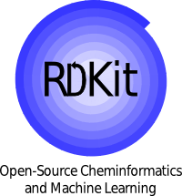
</p>

<p align="center">
  
</p>

A production-minded, research-first platform for molecular intelligence workflows, from data acquisition and model training to simulation-aware candidate prioritization and AI-assisted decision support.

**ZANE Features:**
- **Professional Terminal Interface**: SOTA AI-driver KB721H66 branded dashboard with 7-line ASCII header
- **Simple-by-Default Design**: Clean default view with click-through access to detailed analysis panels
- **Simulation-Only Compound Design**: Generate virtual carbon/hydrocarbon candidates from user-defined characteristics
- **Real-Time Training Monitoring**: Track epochs to 100% completion with live loss metrics and model health
- **Drug Composition Analysis**: Beta-mode composition tables showing probable active/stabilizer/carrier percentages
- **Command-Driven Experience**: Guided setup, aliases (`start`, `go`), and on-demand detail panels

## Executive Summary

ZANE unifies the core layers of computational drug discovery:

- Molecular data ingestion and harmonization  
- Learning pipelines (GNN, Transformer, Ensemble) with 100-epoch completion tracking
- Property and ADMET assessment with simulation-only composition analysis
- Custom virtual compound generation (hydrocarbon/carbon compounds from traits)
- Physics-informed simulation hooks
- Synthesis feasibility tooling
- **Professional terminal dashboard** with ZANE branding and simple-by-default view
- Meta Llama-powered AI support with web/PDF evidence integration

The repository is intended for scientific teams that need a repeatable, extensible, and operator-friendly environment for accelerating discovery iterations.

## Table of Contents

1. Platform Scope
2. Key Capabilities
3. 2026 Upgrade Highlights
4. Architecture
5. Repository Layout
6. Installation
7. Quick Start
8. Operations Guide
9. AI Support (Meta Llama)
10. Dashboard Operations
11. Workflow Blueprints
12. Quality and CI/CD
13. Security and Responsible Use
14. Troubleshooting
15. Contribution Standards
16. License

## 1. Platform Scope

ZANE is designed to support the full loop of computational triage:

1. Gather molecules from multiple sources.
2. Convert molecules to model-ready representations.
3. Train and evaluate predictive models.
4. Estimate ADMET and related quality signals.
5. Incorporate simulation evidence where available.
6. Rank and export candidates for expert review.

## 2. Key Capabilities

### Data Intelligence

- Multi-source collection pipelines (PubChem, ChEMBL, approved drugs)
- Deduplicated dataset merging and caching
- Structured molecular featurization workflows

### Modeling

- Graph Neural Networks for structure-aware learning
- Transformer pipelines for sequence/fingerprint modeling
- Ensemble mode for robust aggregate scoring
- Training with detailed epoch-level progress (100/100 epochs, 100% completion tracking)

### Evaluation and Ranking

- Property prediction support
- ADMET and quality indicators (including QED and SA)
- Simulation-only drug composition analysis for beta testing
- Custom compound generation from user-defined characteristics (consumability, performance, usage profiles)
- Candidate-level result aggregation for triage

### Operations

- Unified CLI command surface with aliases (`start`, `go`)
- Professional Rich terminal dashboard with ZANE ASCII branding
- Simple-by-default dashboard with command-driven detail panels (`--detail-panels`)
- Simulation-only custom hydrocarbon/carbon compound generation (`--custom-characteristics`)
- Interactive guided setup mode (`--guided`)
- Artifact-friendly execution model

### AI Assistance

- Meta Llama-backed assistant for strategy and interpretation support
- Context-injected prompting for research workflows
- Query-driven ranking and filtering
- Web/PDF evidence collection and Cerebras API integration

## 3. 2026 Upgrade Highlights

This release adds deep external-ecosystem interoperability and upgrades simulation/research execution paths.

### 3.1 External Ecosystem Integration Layer

- Added centralized integration registry in `drug_discovery/integrations.py`.
- Added external tooling bridge in `drug_discovery/external_tooling.py`.
- Added runtime status introspection command:

```bash
python -m drug_discovery.cli integrations
```

This command reports:

- Submodule registration status
- Local checkout presence
- Python import availability
- Effective integration availability

### 3.2 Integrated Repositories

Tracked under `external/` as submodules:

- AiZynthFinder (retrosynthesis core)
- REINVENT4 (RL molecule generation)
- GT4SD molecular-design (multi-model generation pipeline)
- GT4SD core framework (property/scoring/generation ecosystem)
- RDKit (core cheminformatics toolkit)
- IBM Molformer (transformer chemistry models)
- MOSES (molecule quality benchmarking)
- GuacaMol (drug design benchmark tasks)

New elite integrations added for multi-stage chemistry + biology + physics workflows:

- Molecular Transformer (reaction outcome prediction)
- DiffDock (diffusion docking)
- TorchDrug (GNN property scoring)
- OpenFold (protein structure prediction)
- OpenMM (molecular dynamics)
- Pistachio (reaction dataset tooling)

Sync them locally into `external/`:

```bash
bash scripts/pull_elite_repos.sh
```

Run the integrated ranking pipeline:

```bash
python -m drug_discovery.cli elite-pipeline \
  --smiles "CCO" "CCN" "c1ccccc1" \
  --reactants "CCO.CN" \
  --target-protein "EGFR" \
  --top-k 3
```

### 3.3 Backend and Runtime Upgrade Coverage

- `drug_discovery/synthesis/backends.py`
  - AiZynthFinder backend now uses centralized integration detection.
  - Better diagnostics for missing config/dependency states.

- `drug_discovery/generation/backends.py`
  - Added `molecular-design` backend.
  - Added seed-SMILES canonicalization using REINVENT conversion utilities when available.
  - Added richer metadata for backend attempts and pipeline script visibility.

- `drug_discovery/benchmarking/backends.py`
  - MOSES and GuacaMol wrappers now use centralized integration availability checks.

- `drug_discovery/testing/drug_combinations.py`
  - Combination features now leverage external tooling:
    - REINVENT canonicalization bridge
    - GT4SD property predictors (when available)
  - Fingerprint similarity uses robust RDKit Tanimoto API.

- `drug_discovery/simulation/biological_response.py`
  - ADME/simulation paths now use canonicalized SMILES and GT4SD property predictors when available.
  - Fully preserves fallback behavior when optional dependencies are unavailable.

### 3.4 CLI and UX Upgrades

- Added `integrations` command for operational visibility.
- Extended generation backend defaults to include `molecular-design`.
- Improved CLI import behavior so non-dashboard commands do not require dashboard-only dependencies.

### 3.5 Packaging and Dependency Upgrades

- Added `integrations` extra in `setup.py` for optional ecosystem packages.

Example:

```bash
pip install -e .[integrations]
```

### 3.6 Suggested Validation Workflow

Run these commands after setup to validate upgraded features:

```bash
# 1) Inspect optional integration status
python -m drug_discovery.cli integrations

# 2) Verify generation backend routing
python -m drug_discovery.cli generate --prompt "kinase inhibitor" --num 5 \
  --backends reinvent4 gt4sd molecular-design molformer

# 3) Run benchmark wrappers (if deps available)
python -m drug_discovery.cli benchmark --suite guacamol
python -m drug_discovery.cli benchmark --suite moses

# 4) Run retrosynthesis research flow
python -m drug_discovery.cli synthesis-research "CCO" --max-results 3
```

## 4. Architecture

ZANE follows a layered architecture for maintainability and extension safety:

- Interface Layer: CLI and terminal dashboard
- Orchestration Layer: pipeline and agent coordination
- Intelligence Layer: models, predictors, evaluators, optimizers
- Science Layer: docking, molecular dynamics, retrosynthesis
- Data Layer: collection, featurization, datasets
- Platform Layer: tests, linting, CI/CD, packaging

### Runtime Flow

1. Collect and merge molecular inputs.
2. Build train/test datasets.
3. Train selected model architecture.
4. Evaluate model behavior and prediction quality.
5. Score and rank candidate molecules.
6. Monitor via dashboard and export artifacts.

## 5. Repository Layout

Primary modules:

- drug_discovery/data: collection, featurization, dataset logic
- drug_discovery/models: GNN, Transformer, Ensemble, equivariant components
- drug_discovery/training: training loop and closed-loop utilities
- drug_discovery/evaluation: property/ADMET prediction and model evaluation
- drug_discovery/physics: docking and MD simulation utilities
- drug_discovery/synthesis: retrosynthesis and feasibility support (optional AiZynthFinder integration via `AIZYNTH_CONFIG`)
- drug_discovery/generation: optional molecule generation backends (REINVENT4, GT4SD, molecular-design, Molformer)
- drug_discovery/benchmarking: optional benchmarking backends (MOSES, GuacaMol)
- drug_discovery/integrations.py: centralized external ecosystem registry and availability checks
- drug_discovery/optimization: Bayesian and multi-objective optimization
- drug_discovery/agents: multi-agent orchestration framework
- drug_discovery/dashboard.py: terminal dashboard implementation
- drug_discovery/ai_support.py: Meta Llama integration

## 6. Installation

### Fast Clone Bootstrap (Auto Installs + Opens Dashboard)

`git clone` alone cannot safely auto-run installation (Git intentionally blocks this).
Use the secure one-command bootstrap after clone:

```bash
git clone https://github.com/cosmic-hydra/zane.git
cd zane
bash scripts/bootstrap_and_dashboard.sh
```

Low-disk environments use lite mode by default and still launch the dashboard.
For full dependency installation, use:

```bash
bash scripts/bootstrap_and_dashboard.sh --full
```

You can also run:

```bash
make bootstrap-dashboard
```

### Standard Setup

```bash
pip install -r requirements.txt
```

### Install as a Package

Local source install:

```bash
pip install -e .
```

Install directly from GitHub:

```bash
pip install git+https://github.com/cosmic-hydra/zane.git
```

`pip install zane` from PyPI will work once the project is published to PyPI under the `zane` name.

### Recommended Virtual Environment

```bash
python -m venv .venv
source .venv/bin/activate
pip install --upgrade pip
pip install -r requirements.txt
```

### Optional GPU Validation

```bash
python -c "import torch; print(torch.cuda.is_available())"
```

### Environment Variables

Create a local env file from the template and keep secrets out of source control:

```bash
cp .env.example .env
```

Common optional settings include `GOOGLE_CSE_API_KEY`, `GOOGLE_CSE_ID`, `NCBI_API_KEY`, and `CEREBRAS_API_KEY`.

### Optional Multi-Language Accelerator (Go)

ZANE includes an optional Go backend for faster web search retrieval in synthesis workflows.

Build the Go helper:

```bash
make build-go-fastsearch
export ZANE_GO_SEARCH_BIN="$PWD/tools/bin/zane-fastsearch"
```

This binary is used by synthesis research flows as a fast fallback when Google CSE is not configured.

### External Ecosystem Integrations

ZANE now tracks and integrates these optional upstream repositories via git submodules under `external/`:

- AiZynthFinder (retrosynthesis core)
- REINVENT4 (RL generation)
- molecular-design (multi-model generation)
- gt4sd-core (generative framework)
- RDKit (cheminformatics)
- Molformer (transformer models)
- MOSES (molecule quality benchmarks)
- GuacaMol (drug-design benchmark tasks)

Check integration/runtime status at any time:

```bash
python -m drug_discovery.cli integrations
```

Run generation with explicit backend order (including molecular-design):

```bash
python -m drug_discovery.cli generate --prompt "kinase inhibitor" --backends reinvent4 gt4sd molecular-design molformer
```

## 7. Quick Start

### Train a Baseline Model

```bash
python -m drug_discovery.cli train --model transformer --epochs 20 --batch-size 32
```

### Run Property Prediction

```bash
python -m drug_discovery.cli predict "CC(=O)OC1=CC=CC=C1C(=O)O" \
  --model gnn \
  --checkpoint ./checkpoints/gnn_model.pt
```

### Run ADMET Check

```bash
python -m drug_discovery.cli admet "CC(=O)OC1=CC=CC=C1C(=O)O"
```

## 8. Operations Guide

### Scientific Revision Log (2026-03-23)

The following protocol upgrades were applied and validated:

- Data protocol:
  - Invalid SMILES rejection at collection and merge time.
  - Data quality report generation with validity ratio and duplicate counts.
  - DrugBank CSV/TSV ingestion with schema normalization (`smiles`, `name`, `source`).
- Evaluation protocol:
  - Seeded random split and Bemis-Murcko scaffold split.
  - Scaffold k-fold split utility for robust molecular benchmarking.
  - Regression calibration utilities (expected calibration error and interval coverage).
- Dashboard protocol:
  - Theme presets (`lab`, `neon`, `classic`) and motion intensity controls.
  - Runtime telemetry panel (CPU/GPU/memory traces, live trends).
  - Pipeline flow orchestrator panel and protocol compliance panel.

### Reproducible Benchmark Artifact

- Artifact path: `outputs/reports/scientific_benchmark_20260323.json`
- Protocol:
  - seed=42
  - split=scaffold
  - model=transformer
  - epochs=4
  - batch_size=16
  - samples=64 (synthetic benchmark set)
- Result snapshot:
  - best_val_loss=0.2455411255
  - rmse=0.4955210647
  - mae=0.4290055037
  - r2=-0.0410919189
  - pearson_r=-0.1608690401

### Verification Status

- Test command: `pytest -q`
- Outcome: 102 passed, 0 failed in default run.

### Data Collection

```bash
python -m drug_discovery.cli collect --sources pubchem chembl --limit 500
```

### Dashboard (Static)


```bash
python -m drug_discovery.cli dashboard --static
```

Human-friendly command (installed package):

```bash
zane dashboard --static
```

Beginner guided mode (interactive prompts):

```bash
zane dashboard --guided
```

Shortcut aliases (same as dashboard):

```bash
zane start --static
zane go --static
```

**Show Detailed Panels On-Demand:**

```bash
# Show only analytics and AI panels
zane dashboard --static --detail-panels analytics ai

# Show all panels (combinations, composition, analytics, AI)
zane dashboard --static --detail-panels all

# Show with custom compounds
zane dashboard --static --custom-characteristics "consumable hydrocarbon" --custom-count 4
```

### Dashboard Feature and Function Screenshot Gallery

#### 1. Default Simple Overview

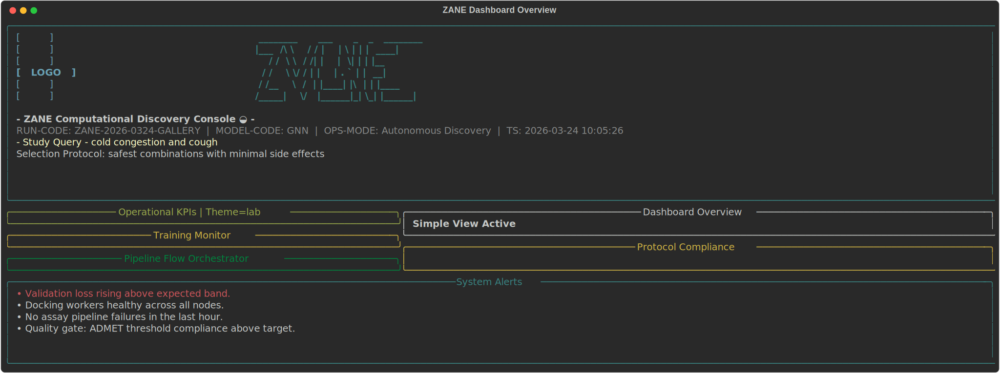

```bash
zane dashboard --static
```

#### 2. Simulated Combination Ranking Panel

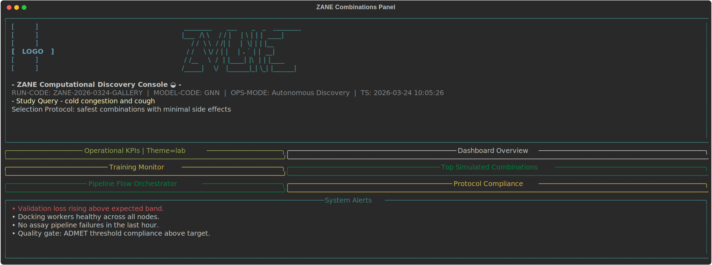

```bash
zane dashboard --static --detail-panels combinations
```

#### 3. Composition / Beta Testing Panel

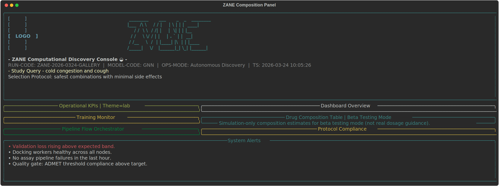

```bash
zane dashboard --static --detail-panels composition
```

#### 4. Analytics and Runtime Telemetry

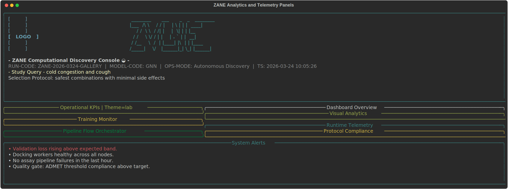

```bash
zane dashboard --static --detail-panels analytics
```

#### 5. AI Copilot Panel

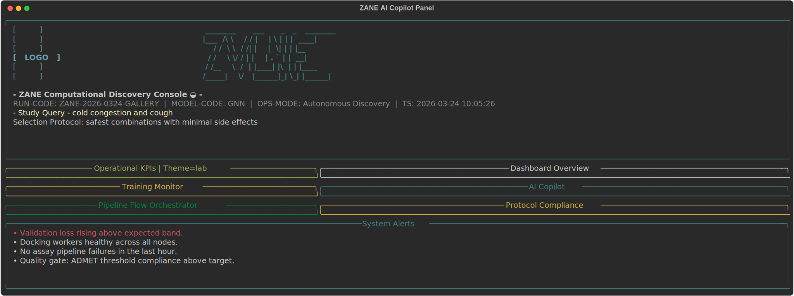

```bash
zane dashboard --static --detail-panels ai --with-ai
```

#### 6. Full Dashboard Function Set (All Panels)

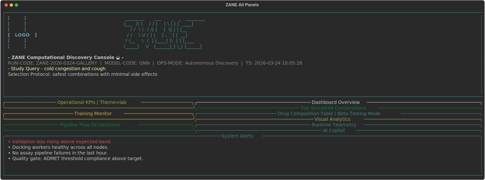

```bash
zane dashboard --static --detail-panels all --with-ai
```

#### 7. Custom Compound Generation Function

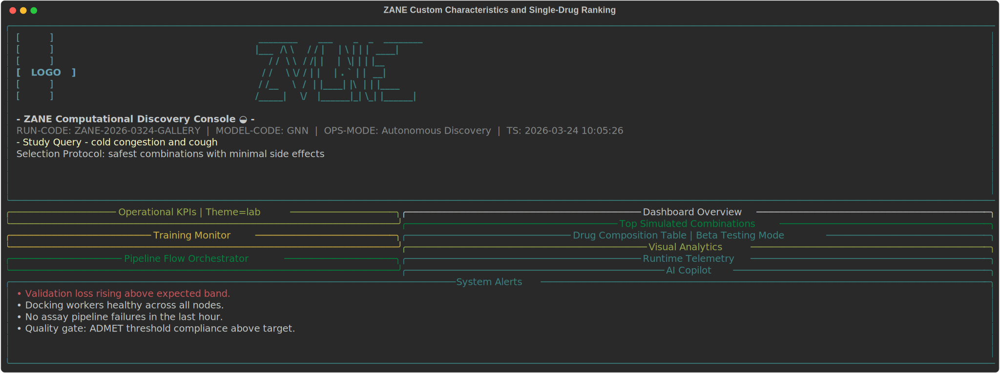

```bash
zane dashboard --static --detail-panels all \
  --custom-characteristics "consumable hydrocarbon high performance low side effects" \
  --custom-count 6
```

#### 8. No-Simulated-Combinations Mode

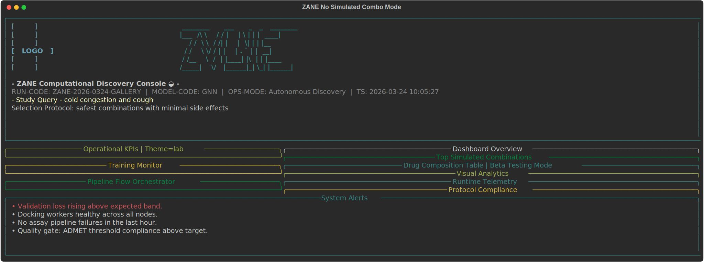

```bash
zane dashboard --static --detail-panels combinations composition analytics --no-sim-combos
```

#### 9. Neon Theme

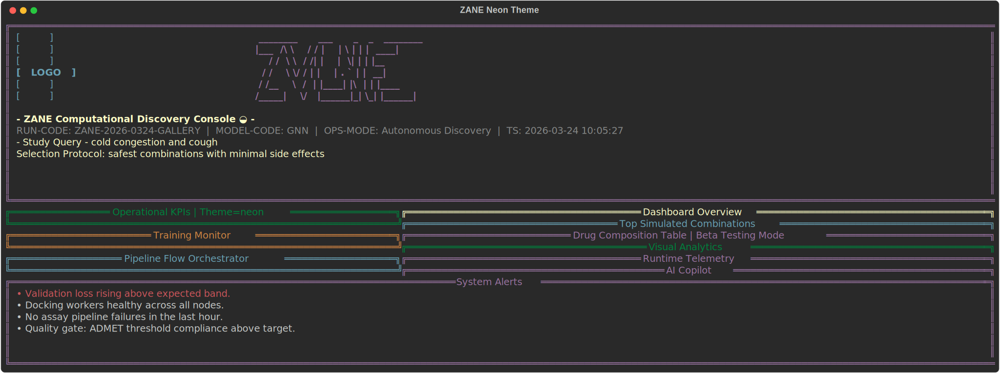

```bash
zane dashboard --static --detail-panels all --theme neon
```

#### 10. Classic Theme

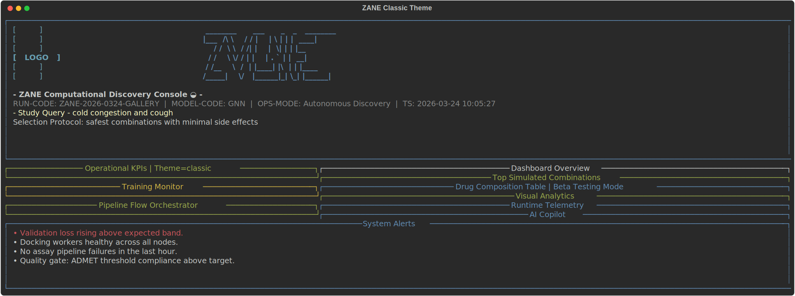

```bash
zane dashboard --static --detail-panels all --theme classic
```

### Dashboard (Live)

```bash
python -m drug_discovery.cli dashboard --refresh 1.0 --iterations 60
```

### Synthesis Research (Internet + AI)

```bash
python -m drug_discovery.cli synthesis-research "CCO" --target EGFR --max-results 5
```

Read linked resources (including PDFs) with controlled depth:

```bash
python -m drug_discovery.cli synthesis-research "CCO" \
  --max-results 5 \
  --max-resource-reads 3
```

Disable URL/PDF reading if needed:

```bash
python -m drug_discovery.cli synthesis-research "CCO" --no-resource-read
```

Offline-safe mode:

```bash
python -m drug_discovery.cli synthesis-research "CCO" --no-internet --no-ai
```

### Operational Notes

- Keep checkpoints versioned by experiment intent.
- Use consistent splits for model-to-model comparisons.
- Persist run outputs under dedicated artifact directories.

## 9. AI Support (Meta Llama)

### Basic Command

```bash
python -m drug_discovery.cli assist "Summarize risk factors in the current candidate shortlist"
```

### Advanced Command with Context

```bash
python -m drug_discovery.cli assist "Draft next assay plan" \
  --model-id meta-llama/Llama-3.2-1B-Instruct \
  --context "Top candidates: Caffeine, Warfarin" \
  --max-new-tokens 300 \
  --temperature 0.7 \
  --top-p 0.9
```

### Access Requirements

- Meta Llama checkpoints may be gated.
- Ensure model access is approved in your Hugging Face account.
- Provide an auth token in environment variables (for example, HF_TOKEN).

## 10. Dashboard Operations

The terminal dashboard is optimized for operator awareness during active runs. It features a professional ZANE ASCII banner and operates in **simple-by-default mode** for clean, focused viewing.

### Dashboard User Interface

- **Professional Header**: 7-line ZANE ASCII banner with run code, model type, and mission query
- **Operational KPIs Panel**: Throughput, generation count, active jobs, hit rate, QED averages, SA metrics, best binding, latency
- **Training Monitor**: Real-time epoch progress (e.g., 100/100 epochs = 100% complete), loss curves, model health status
- **System Alerts**: Operational status and anomaly detection
- **Simple Overview Panel**: Shows available detail commands (default view)

### Dashboard Views

The dashboard starts in **simple mode** (header + KPI + training + alerts only). Detailed analysis panels are visible only when explicitly requested.

**Default Simple View:**
```bash
zane dashboard --static
```

**Show Specific Detail Panels:**
```bash
zane dashboard --static --detail-panels combinations
zane dashboard --static --detail-panels composition composition
zane dashboard --static --detail-panels analytics ai
zane dashboard --static --detail-panels all
```

**Available Detail Panels:**
- `combinations`: Top simulated drug combinations ranked by score
- `composition`: Drug composition table with probable active/stabilizer/carrier % and beta dose index (simulation-only)
- `analytics`: Visual analytics with score bars, metric histograms, and sparkline trends
- `ai`: AI copilot recommendations from local LLM, web evidence, and optional Cerebras guidance

### Quick Operator Commands

**Interactive Guided Setup:**
```bash
zane dashboard --guided
```
This prompts for disease/need, filter preferences, live mode, and optional data/AI sources.

**Shortcut Aliases:**
```bash
zane start --static --query "cold congestion"
zane go --static --query "respiratory support" --detail-panels all
```

**With Custom Compound Generation (Simulation-Only):**
```bash
zane dashboard --static \
  --query "respiratory support" \
  --custom-characteristics "consumable hydrocarbon high performance daily usage" \
  --custom-count 5 \
  --detail-panels composition combinations
```

**Live Mode (Continuous Updates):**
```bash
zane dashboard --refresh 1.0 --iterations 100 --query "cold relief" --detail-panels analytics
```

### Drug Composition Panel (Beta Testing Mode)

The composition panel shows top 5 ranked candidates with simulation-only composition estimates:
- **Probable Composition**: Active ingredient %, stabilizer %, carrier % breakdown
- **Beta Dose Index**: Scored metric (not real dosage, for screening only)
- **Usage Profile**: Consumable-screening vs controlled-screening designation

### Custom Compound Generation (Simulation-Only)

Generate virtual carbon/hydrocarbon compounds from user-defined characteristics:

```bash
zane dashboard --static \
  --custom-characteristics "aromatic ester carbon consumable" \
  --custom-count 6
```

**Supported Characteristic Keywords:**
- Consumption: `consumable`, `oral`, `food`, `beverage`
- Performance: `high`, `efficacy`, `potent`, `strong`
- Usage: `daily`, `chronic`, `routine`, `stable`
- Safety: `safe`, `low`, `toxicity`, `gentle`
- Chemistry: `hydrocarbon`, `aromatic`, `ester`, `alkyl`, `carbon`

Generated compounds appear in rankings as `KB721H66-<FOCUS>-<N>` and are included in all scoring and combination analysis.

### Displayed Signal Groups

- **Run Metadata**: SOTA AI-driver KB721H66 designation, run code, model type, operation mode, timestamp
- **KPI Panel (OPS-CODESET-7)**: KPI-THRPT, KPI-GEN, KPI-HIT, KPI-QED, KPI-SA, KPI-BIND, KPI-LAT
- **Training Monitor**: Epoch progress bar (e.g., 100/100 = 100%), train/validation loss, model health status
- **Detail Panels** (on-demand): Combinations, composition, analytics, AI copilot
- **Alerts and Status**: Operational health, anomaly warnings

## 11. Workflow Blueprints

### Baseline Discovery Workflow

1. Collect 200 to 1000 molecules.
2. Train a transformer baseline.
3. Evaluate and shortlist by quality metrics.
4. Run ADMET checks on the shortlist.
5. Review status in dashboard and export outputs.

### Comparative Workflow

1. Train GNN and transformer with aligned splits.
2. Compare metrics and top-k overlap.
3. Use ensemble mode for consensus ranking.

### Human-in-the-Loop Workflow

1. Export top candidates.
2. Use AI support to draft test priorities.
3. Finalize shortlist with domain experts.

### BoltzGen Binder Design Workflow

Install the upstream package (`pip install boltzgen`) and launch the integrated wrapper:

```bash
zane boltzgen path/to/design.yaml \
  --output outputs/boltzgen/demo \
  --protocol protein-anything \
  --num-designs 50 \
  --budget 5 \
  --top-k 3 \
  --score-key refolding_rmsd
```

The CLI delegates to the official BoltzGen pipeline, reuses cached downloads when available, and returns a JSON summary of the top-ranked designs. Use `--steps` to run only parts of the pipeline or `--devices` to set accelerator counts.

## 12. Quality and CI/CD

Recommended pre-push checks:

```bash
python -m pytest -q
python -m ruff check .
python -m black --check .
```

Expected quality posture:

- Tests must pass for core modules.
- Lint and format checks should be clean.
- User-facing behavior changes should be documented.

## 13. Security and Responsible Use

This repository is intended for research and decision support.

- Do not treat outputs as direct clinical recommendations.
- Validate predictions experimentally.
- Apply governance and provenance controls for data and results.
- Ensure expert review before any high-impact downstream use.

## 14. Dashboard Flags Reference (Comprehensive)

### Core Dashboard Flags

| Flag | Type | Default | Purpose |
|------|------|---------|---------|
| `--static` | bool | False | Render one static dashboard frame (no live updates) |
| `--refresh` | float | 1.0 | Live refresh interval in seconds |
| `--iterations` | int | 30 | Number of live refresh cycles |
| `--detail-panels` | choices | none | Show detail panels: combinations, composition, analytics, ai, all |
| `--guided` | bool | False | Launch with interactive step-by-step prompts |
| `--query` | string | "" | Natural-language disease/need query for ranking candidates |
| `--filter-query` | string | "" | Ranking preference (e.g., "safest combos", "highest efficacy") |
| `--interactive-query` | bool | False | Prompt for disease/need query before rendering |

### AI & Intelligence Flags

| Flag | Type | Default | Purpose |
|------|------|---------|---------|
| `--with-ai` | bool | False | Enable local AI copilot insights panel |
| `--ai-model-id` | string | artifacts/llama/tinyllama-1.1b-chat | Local or HF model for AI suggestions |
| `--ai-refresh-every` | int | 5 | Refresh AI recomm. every N epochs in live mode |
| `--intel-refresh-every` | int | 3 | Re-read web/PDF/Cerebras intel every N epochs |
| `--no-web-intel` | bool | False | Disable web searching/scraping |
| `--no-pdf-intel` | bool | False | Disable PDF/URL resource reading |
| `--no-cerebras` | bool | False | Disable Cerebras API guidance |

### Simulation & Custom Compound Flags

| Flag | Type | Default | Purpose |
|------|------|---------|---------|
| `--no-sim-combos` | bool | False | Disable simulated combo panel |
| `--custom-characteristics` | string | "" | Traits for custom compound generation (simulation-only) |
| `--custom-count` | int | 4 | Number of custom compounds (1-8) |

### Key Feature Combinations

**Simple Dashboard with Guided Setup:**
```bash
zane dashboard --guided --static
```

**Full Analysis with All Details:**
```bash
zane dashboard --static --detail-panels all \
  --query "cold symptoms" \
  --filter-query "safest combos" \
  --with-ai
```

**Custom Compounds + Composition Analysis:**
```bash
zane dashboard --static \
  --custom-characteristics "consumable hydrocarbon daily usage" \
  --custom-count 5 \
  --detail-panels composition
```

**Live Monitoring with Web Evidence:**
```bash
zane dashboard --refresh 1.0 --iterations 60 \
  --query "antiviral" \
  --detail-panels analytics ai
```

## 15. Recent Feature Updates (Session Summary)

### Dashboard Visual Enhancements
- **Professional ZANE Banner**: 7-line ASCII art header with KB721H66 branding
- **SOTA Designation**: "SOTA AI-driver KB721H66 Drug Discovery Terminal - ZANE"
- **Codename KPIs**: OPS-CODESET-7 with labels (KPI-THRPT, KPI-GEN, KPI-HIT, KPI-QED, KPI-SA, KPI-BIND, KPI-LAT)
- **100% Epoch Tracking**: Dashboard shows real epoch progress (e.g., 100/100 = 100.0%)

### Usability Improvements
- **Simple-by-Default**: Clean default view with on-demand detail panels via `--detail-panels`
- **Friendly Aliases**: `zane start` and `zane go` as alternatives to `zane dashboard`
- **Guided Mode**: Interactive setup with `--guided` flag for non-technical operators

### Simulation Features
- **Custom Compound Generation**: Create virtual carbon/hydrocarbon candidates from user traits
  - Input: `--custom-characteristics "consumable hydrocarbon high performance"`
  - Output: KB721H66-branded virtual molecules in ranking results  
  - Supports: consumability, performance, usage, safety, and chemistry descriptors

- **Drug Composition Analysis Table**: Beta-testing panel showing top 5 candidates with:
  - Probable composition splits (active %, stabilizer %, carrier %)
  - Beta dose index (simulation-only metric)
  - Usage profile tags (consumable-screening vs controlled-screening)

### Intelligence Integration
- **Web/PDF Evidence**: Automatic collection and ranking awareness
- **Cerebras API**: Optional structured guidance from external API
- **Local AI Copilot**: Reasoning and recommendations from LLM
- **Continuous Intel Refresh**: `--intel-refresh-every` controls update cadence

## 16. Troubleshooting

### Llama Model Fails to Load

Potential causes:

- Missing or invalid Hugging Face token
- Access not granted for selected model
- Restricted network environment

### Training Instability

Actions:

- Lower learning rate
- Reduce batch size
- Inspect data quality and target distributions

### CLI Runtime Errors

Actions:

- Confirm virtual environment activation
- Reinstall dependencies
- Re-run with explicit model/checkpoint arguments

## 17. Contribution Standards

Recommended development flow:

1. Create a focused branch.
2. Implement minimal, scoped changes.
3. Run tests and static checks locally.
4. Update documentation for behavior changes.
5. Open PR with validation evidence.

## 18. License

## 19. PyPI Release Workflows

ZANE includes automated packaging workflows in GitHub Actions:

- `.github/workflows/publish-testpypi.yml`: publishes to TestPyPI (main branch changes + manual dispatch)
- `.github/workflows/publish-pypi.yml`: publishes to PyPI (GitHub Release publish + manual dispatch)

### Required GitHub Setup

1. Create repository secrets:
  - `TEST_PYPI_API_TOKEN`
  - `PYPI_API_TOKEN`
2. (Recommended) Create protected environments in GitHub:
  - `testpypi`
  - `pypi`

### Release Flow

1. Merge packaging updates to `main` and verify TestPyPI publish workflow.
2. Create a GitHub Release for a new version.
3. `publish-pypi.yml` triggers and uploads to PyPI.

### Install Examples

After TestPyPI release:

```bash
pip install --index-url https://test.pypi.org/simple/ zane
```

After PyPI release:

```bash
pip install zane
```

CC0 1.0 Universal
