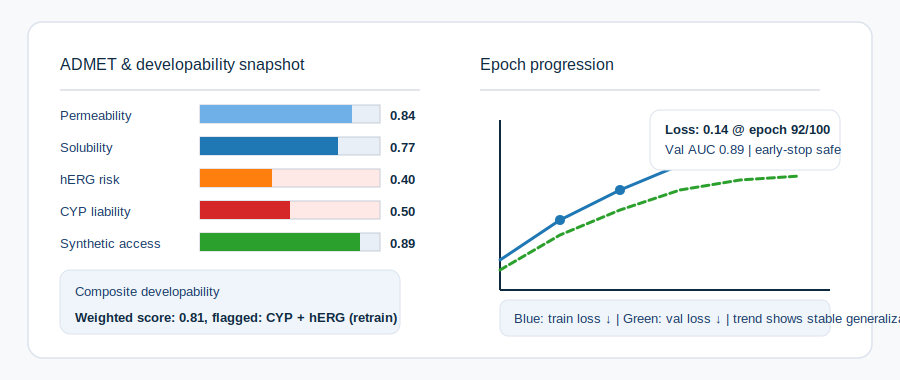

# ZANE: AI-native Drug Discovery Module (beta)

<p align="center">
  
</p>

<p align="center">
  
</p>

ZANE is a production-minded, research-first environment for molecular intelligence workflows. It keeps data ingestion, model training, physics-aware simulation, ADMET scoring, and decision support in one operator-friendly stack so discovery teams can iterate without juggling siloed tools.

> **License Notice:** This repository is proprietary. Viewing is limited to educational purposes; any other use requires prior written permission from Advaith Vaithianathan (advaithv.av7@gmail.com).

## Overview

The platform combines curated molecular data pipelines, graph and transformer learners, property and ADMET predictors, docking and MD stability hooks, and a branded terminal dashboard that surfaces live progress across 100-epoch runs. The intent is simple: keep chemists and ML engineers in one loop where generation, evaluation, simulation, and manufacturability checks inform each other.

## Platform in Action

A typical loop starts with harmonizing molecules from public and proprietary sources, normalizing them into graph and sequence views, and caching features for fast iteration. Training jobs track epochs with real-time loss and health indicators. Scoring blends QED/SA, toxicity risk, synthesizability, docking proxies, and MD stability to produce composite rankings. When external packages such as DiffDock, REINVENT, AiZynthFinder, or OpenMM are present, ZANE routes workloads to those backends; otherwise, it falls back to internal heuristics so runs stay reproducible.

The terminal dashboard favors a simple-by-default layout. You can open detail panes on demand, follow alias commands like `start` and `go`, and export artifacts for downstream notebooks. A Meta Llama-backed copilot is available for research questions, ranking arguments, and evidence gathering without leaving the session.

## Benchmarks and Visuals

ZANE ships with lightweight analytics to show how the stack behaves on curated runs. The figures below are generated from deterministic artifacts under `docs/assets/analytics/` and can be regenerated from the shipped JSON reports.


Predictive envelopes for transformer, GNN validation, and protocol GNN workloads, with scaffold splits and matched sampling, illustrate that the pipeline holds stable error bounds across data slices.


Epoch-by-epoch loss traces track convergence and prevent silent regressions when changing featurization or backends.


ADMET surrogates summarize penalties and error ranges so you can see when toxicity, permeability, and solubility are driving rank shifts.



A compact panel highlighting ADMET risk bars alongside 100-epoch training progression keeps reviewers aligned on both developability and model health.


The Rich-based dashboard presents the full experiment state, with tabs for composition analysis, combination testing, AI copilot prompts, and styled themes for lab or neon modes.

## How ZANE Compares

ZANE complements popular open-source stacks rather than replacing them. The emphasis is on orchestration, multi-objective scoring, and simulation-aware routing in a single operator workflow.

| Project | Primary focus | What ZANE adds |
| --- | --- | --- |
| DeepChem | Broad ML building blocks for cheminformatics | Bundles DeepChem-compatible featurization with opinionated training loops, live epoch telemetry, and ADMET-first scoring defaults. |
| REINVENT | Reinforcement learning for molecule generation | Wraps RL-driven generation with synthesis checks, docking/MD scoring, and composite rankers so proposals are judged on feasibility, not just novelty. |
| DiffDock | Diffusion-based docking | Uses DiffDock as a docking proxy when available, then feeds poses into stability and ADMET filters for end-to-end triage. |
| TorchDrug | GNN property modeling toolkit | Integrates TorchDrug heads within a broader pipeline that also handles data harmonization, simulation hooks, and dashboarded operations. |
| MOSES / GuacaMol | Benchmark suites for generative models | Keeps benchmark harnesses wired into the same CLI, letting you compare generative modes and filters without switching repos. |

## Installation

Create a fresh virtual environment, install the base requirements, and optionally enable integrations when you have the corresponding third-party checkouts.

```bash
python -m venv .venv
source .venv/bin/activate
pip install -e .
# Optional extras when external toolkits are available
pip install -e .[integrations]
```

If you rely on DeepChem, use Python versions below 3.12 or install DeepChem separately, as the dependency is gated on interpreter version.

## Quick Start

Run the physics-aware generator with pharmacophore constraints and MD-informed scoring:

```bash
python -m drug_discovery.cli physics-gen \
  --seed-smiles "c1ccccc1" "CC(=O)O" \
  --num 6 \
  --target-protein "EGFR" \
  --pharmacophore '{"min_hba":2,"max_rings":3}' \
  --known-smiles "CCO" "CCN"
```

Inspect available integrations and their import status before launching workflows:

```bash
python -m drug_discovery.cli integrations
```

Use the elite pipeline to run generation, retrosynthesis-aware filtering, and ranking in one call:

```bash
python -m drug_discovery.cli elite-pipeline \
  --smiles "CCO" "CCN" "c1ccccc1" \
  --reactants "CCO.CN" \
  --target-protein "EGFR" \
  --top-k 3
```

## Operations and Testing

Training, evaluation, and benchmarking commands emit artifact-ready outputs for dashboards and notebooks. The `Makefile` exposes linting and formatting via `python -m ruff check drug_discovery tests` and `python -m black drug_discovery tests`. A lightweight test sweep can be run with `python -m pytest -q`; install optional scientific dependencies (e.g., `torch`, `rdkit`, `deepchem`) to avoid collection-time import errors.

## Integrations

External repositories live under `external/` and can be pulled with `bash scripts/pull_elite_repos.sh`. When they are present, backends such as AiZynthFinder for retrosynthesis, Molecular Transformer for reaction outcome prediction, DiffDock for docking, OpenFold for protein structures, and OpenMM for molecular dynamics are automatically detected through `drug_discovery/integrations.py`.

## License

ZANE is distributed under the ZANE Proprietary License v1.0. Viewing is permitted for educational purposes only; all other usage requires explicit written permission from Advaith Vaithianathan (advaithv.av7@gmail.com).
